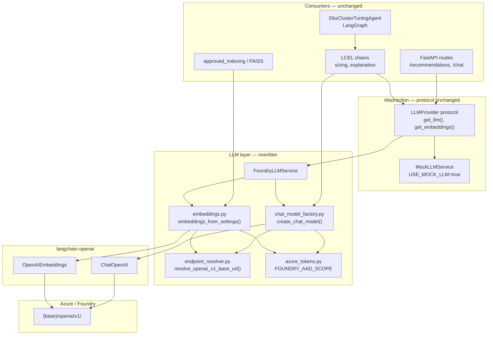
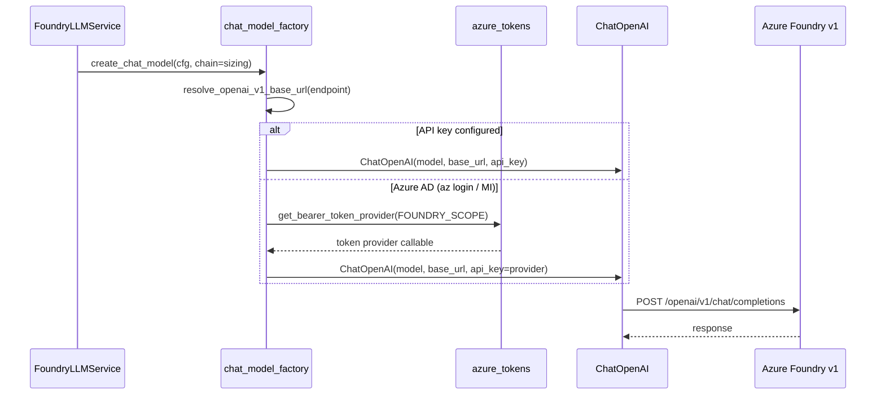
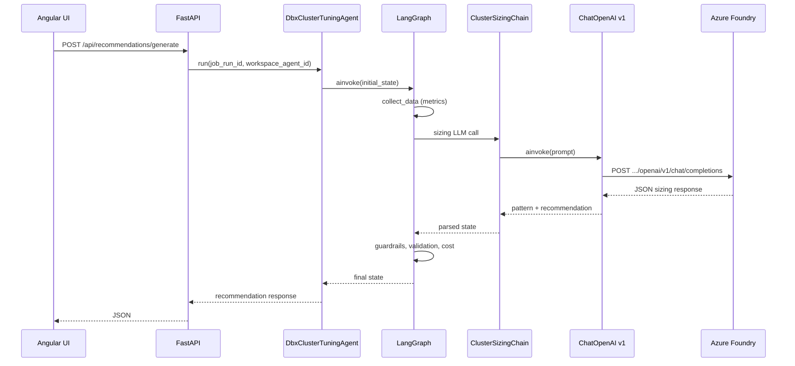

# Backlog — AI Foundry / LangChain / LangGraph Upgrade

**Purpose:** Track the greenfield upgrade of LLM integration from classic `AzureChatOpenAI` (dated `api-version` URLs) to **Microsoft Foundry + OpenAI v1** via latest **LangChain**, **langchain-openai**, and **LangGraph** packages.

**Branch:** `feature/upgrade-openai-to-ai-foundry`

**Related docs:** [architecture.md](./architecture.md), [recommendation-pipeline.md](./recommendation-pipeline.md), [APPROVED_RAG_VALIDATION_WINDOWS.md](./APPROVED_RAG_VALIDATION_WINDOWS.md), [BACKLOG.md](./BACKLOG.md)

**Last updated:** 2026-06-25 (implementation complete on `feature/upgrade-openai-to-ai-foundry`)

---

## Progress summary

| Phase | Title | Status |
|-------|--------|--------|
| 0 | Overview & design sign-off | Done |
| 1 | Dependency upgrade | Done |
| 2 | Endpoint resolver + auth | Done |
| 3 | Chat model (v1 `ChatOpenAI`) | Done |
| 4 | Embeddings (v1 `OpenAIEmbeddings`) | Done |
| 5 | Config & connection model cleanup | Done |
| 6 | Tests, validation & docs | Done |
| 7 | Service rename & grep cleanup | Done |

**Overall status:** `7 / 7` phases complete

### Implementation notes (2026-06-25)

- **Packages:** `langchain==1.3.11`, `langchain-openai==1.3.3`, `langgraph==1.2.6`, `openai>=2.44.0`
- **New:** `shared/azure/endpoint_resolver.py`, `AI/src/core/llm/foundry_llm_service.py`
- **Removed:** `AI/src/core/llm/azure_openai_service.py`, `api_version` from settings/config/UI
- **Renamed:** `AzureOpenAIService` → `FoundryLLMService`, `create_azure_chat_model` → `create_chat_model`
- **Tests:** `135 passed, 3 skipped` with `USE_MOCK_LLM=true`
- **Pending manual:** `make validate-azure` against a live Foundry resource (requires `.env` secrets)

---

## 1. Overview

### 1.1 Why this effort

The framework currently calls Azure through **LangChain `AzureChatOpenAI`** and **`AzureOpenAIEmbeddings`**, which use the **classic Azure OpenAI REST shape**:

- `{endpoint}/openai/deployments/{name}/chat/completions?api-version=...`
- Required `api_version` parameter (default `2024-05-01-preview`)
- Auth scope `https://cognitiveservices.azure.com/.default`

Microsoft’s current guidance for **Azure AI Foundry** and new integrations is the **OpenAI v1 compatible route**:

- `{base}/openai/v1/chat/completions` — no `api-version`
- Deployment name passed as `model`
- Auth scope `https://ai.azure.com/.default`
- Implemented via **`langchain-openai`** `ChatOpenAI` / `OpenAIEmbeddings`, not the deprecated Azure AI Inference SDK (`services.ai.azure.com/models`)

### 1.2 Scope

| In scope | Out of scope (separate backlog) |
|----------|--------------------------------|
| Bump `langchain`, `langchain-openai`, `langgraph`, `openai` | `langchain-azure-ai` project-level Foundry APIs |
| Replace chat + embedding client construction | LangGraph checkpoints / persisted agent state |
| Single endpoint resolver for Foundry URLs | Databricks-native agent migration |
| Remove `api_version` from config & UI | LangSmith tracing |
| Update tests, validate script, ops docs | Angular UI changes (no LangChain deps) |

### 1.3 Greenfield assumption

This framework **has not been deployed to production**. There is:

- **No** backward-compatibility requirement
- **No** legacy code path or feature flag
- **No** migration window or output regression baseline
- **No** dual auth-scope fallback

Ship the target design directly.

### 1.4 What stays unchanged

The upgrade changes **transport only** — not product behavior:

- LangGraph pipeline (`DbxClusterTuningAgent`) — same nodes and flow
- LCEL chains (`ClusterSizingChain`, `RecommendationExplanationChain`)
- Guardrails, sizing policy, ingest contract
- Workspace `ai_foundry` connection concept (endpoint + deployment names)
- `LLMProvider` protocol and `MockLLMService` for CI
- RAG backends (Azure Search, FAISS)

---

## 2. Current vs target

### 2.1 Package versions

| Package | Current (`requirements.txt`) | Target |
|---------|------------------------------|--------|
| `langchain` | 1.2.10 | 1.3.11 |
| `langchain-openai` | 1.1.10 | 1.3.3 |
| `langgraph` | 1.0.10 | 1.2.6 |
| `openai` | `>=1.104.2,<3` | `>=2.44.0,<3` |
| `langchain-community` | 0.4.1 | latest compatible |
| `langchain-azure-ai` | — | not added (unless project API needed later) |

### 2.2 LLM client

| Aspect | Current | Target |
|--------|---------|--------|
| Chat class | `AzureChatOpenAI` | `ChatOpenAI` |
| Embeddings class | `AzureOpenAIEmbeddings` | `OpenAIEmbeddings` |
| Endpoint param | `azure_endpoint` | `base_url` → `{base}/openai/v1/` |
| Model param | `azure_deployment` | `model` (deployment name) |
| API version | Required | **Removed** |
| Auth scope | `cognitiveservices.azure.com` | `ai.azure.com` |
| Service class | `AzureOpenAIService` | `FoundryLLMService` (rename) |

### 2.3 Files in the LLM integration surface

| File | Role today | Change |
|------|------------|--------|
| `AI/src/core/llm/chat_model_factory.py` | Creates `AzureChatOpenAI` | Rewrite → `ChatOpenAI` v1 |
| `AI/src/core/llm/azure_openai_service.py` | Singleton + embeddings | Rename + v1 embeddings |
| `shared/rag/embeddings.py` | Embeddings for indexing | v1 via shared resolver |
| `shared/auth/azure_tokens.py` | AAD token + scope | Foundry scope |
| `shared/config/settings.py` | `azure_openai_api_version` | Remove field |
| `shared/config/connection_types.py` | `ai_foundry` UI fields | Remove API version field |
| `shared/config/yaml_loader.py` | YAML → flat mapping | Remove api_version |
| `config/platform.yaml` | Platform defaults | Remove api_version |
| `.env.example` | Env template | Update examples |

**New file:** `shared/azure/endpoint_resolver.py`

---

## 3. Design

### 3.1 Layered architecture



### 3.2 Endpoint resolver

Single function normalizes any stored endpoint to an OpenAI v1 `base_url`:

```text
Input (ai_foundry connection / env)              →  Resolved base_url
─────────────────────────────────────────────────────────────────────────
https://{r}.openai.azure.com                     →  https://{r}.openai.azure.com/openai/v1/
https://{r}.openai.azure.com/                    →  (same, trailing slash stripped)
https://{r}.services.ai.azure.com                →  https://{r}.services.ai.azure.com/openai/v1/
https://{r}.services.ai.azure.com/api/projects/{id}  →  strip project path → v1 base
https://{r}.openai.azure.com/openai/v1           →  normalize trailing slash
```

Foundry **project URLs** are normalized to the resource-level v1 route. Full **project API** integration (`langchain-azure-ai`) is deferred — see [BACKLOG.md](./BACKLOG.md) Foundry project API item.

### 3.3 Authentication



| Method | When | Scope / credential |
|--------|------|-------------------|
| API key | Local dev, `.env` | `AZURE_OPENAI_API_KEY` |
| Bearer token provider | `az login`, Managed Identity | `https://ai.azure.com/.default` |

No stored tokens in Postgres; runtime fetch via `DefaultAzureCredential` (existing pattern).

### 3.4 Config model (target)

**`ai_foundry` connection fields (UI + resolver):**

| Field | Required | Example |
|-------|----------|---------|
| `azure_openai_endpoint` | Yes | `https://myres.openai.azure.com` |
| `azure_openai_deployment_name` | Yes | `gpt-4o` |
| `azure_openai_embedding_deployment` | No | `text-embedding-3-small` |

**Removed:**

- `azure_openai_api_version` — from Settings, YAML, platform config, connection UI, workspace resolver

**Env vars (`.env.example`):**

```text
AZURE_OPENAI_ENDPOINT=https://{resource}.openai.azure.com
AZURE_OPENAI_DEPLOYMENT_NAME=gpt-4o
AZURE_OPENAI_EMBEDDING_DEPLOYMENT=text-embedding-3-small
AZURE_OPENAI_API_KEY=           # optional if using az login
USE_MOCK_LLM=true               # CI / local without Azure
```

### 3.5 Factory contract (target code shape)

```python
from langchain_core.language_models import BaseChatModel
from langchain_openai import ChatOpenAI

def create_chat_model(cfg: Settings, *, chain: ChainKind = "default") -> BaseChatModel:
    base_url = resolve_openai_v1_base_url(cfg.azure_openai_endpoint)
    model = cfg.azure_openai_deployment_name or cfg.default_model_name
    temperature, top_p = resolve_llm_sampling(cfg, chain)
    # api_key or bearer token provider → ChatOpenAI(...)
```

Chains continue to use LCEL: `prompt | llm | StrOutputParser()` — no chain file changes expected.

### 3.6 Request flow (end-to-end)



LangGraph structure is unchanged; only the HTTP call inside the sizing/explanation chains uses v1.

---

## 4. Phases

### Phase 0 — Overview & design sign-off

**Goal:** Align on scope and greenfield assumptions before code changes.

- [ ] Review this document with team
- [ ] Confirm target: `ChatOpenAI` v1 (not `langchain-azure-ai` project API)
- [ ] Confirm Foundry resource / deployment names for dev validation
- [ ] Create / stay on branch `feature/upgrade-openai-to-ai-foundry`

**Exit criteria:** Design approved; branch ready.

---

### Phase 1 — Dependency upgrade

**Goal:** Latest LangChain / LangGraph packages with **existing** LLM code (pre-rewrite).

| Task | File(s) |
|------|---------|
| [ ] Bump `langchain` → 1.3.11 | `requirements.txt` |
| [ ] Bump `langchain-openai` → 1.3.3 | `requirements.txt` |
| [ ] Bump `langgraph` → 1.2.6 | `requirements.txt` |
| [ ] Bump `openai` → `>=2.44.0,<3` | `requirements.txt` |
| [ ] Bump `langchain-community` to compatible version | `requirements.txt` |
| [ ] Rebuild venv / Docker image | `.venv`, `Dockerfile` |
| [ ] Run `make test` — fix LangGraph API breaks if any | `AI/src/agents/dbx_cluster_tuning_agent/agent.py` |

**Exit criteria:** All mock-LLM tests pass on new package versions.

---

### Phase 2 — Endpoint resolver + auth

**Goal:** Shared infrastructure for v1 URLs and Foundry auth scope.

| Task | File(s) |
|------|---------|
| [ ] Add `shared/azure/endpoint_resolver.py` | new |
| [ ] Add `resolve_openai_v1_base_url()` with unit tests | `shared/tests/test_endpoint_resolver.py` |
| [ ] Replace `AZURE_OPENAI_AAD_SCOPE` with `https://ai.azure.com/.default` | `shared/auth/azure_tokens.py` |
| [ ] Update Makefile `validate-azure` token scope if hardcoded | `Makefile` |

**Exit criteria:** Resolver tests pass for all URL formats in §3.2.

---

### Phase 3 — Chat model (v1 `ChatOpenAI`)

**Goal:** Replace `AzureChatOpenAI` with `ChatOpenAI` on OpenAI v1 route.

| Task | File(s) |
|------|---------|
| [ ] Rewrite `create_azure_chat_model` → `create_chat_model` | `AI/src/core/llm/chat_model_factory.py` |
| [ ] Return `BaseChatModel` type hints | factory, service |
| [ ] Wire resolver + Foundry auth | factory |
| [ ] Update `can_create_chat_model()` if needed | factory |
| [ ] Update chains that import factory directly | `chains/sizing.py`, `chains/explanation.py` |
| [ ] Update `AI/tests/test_azure_openai_service.py` | tests |

**Exit criteria:** `get_llm_provider().get_llm().ainvoke("OK")` succeeds against real Foundry (or documented blocker).

---

### Phase 4 — Embeddings (v1 `OpenAIEmbeddings`)

**Goal:** Same v1 transport for RAG indexing and FAISS.

| Task | File(s) |
|------|---------|
| [ ] Rewrite `embeddings_from_settings()` | `shared/rag/embeddings.py` |
| [ ] Update embeddings init in service | `AI/src/core/llm/azure_openai_service.py` |
| [ ] Remove duplicate `_normalize_azure_endpoint` helpers | factory, service, embeddings → use resolver |
| [ ] Verify FAISS tests still pass | `AI/tests/test_faiss_cache.py` |
| [ ] Verify approved indexing tests | `shared/tests/test_approved_indexing.py` |

**Exit criteria:** Embedding smoke test + FAISS unit tests pass.

---

### Phase 5 — Config & connection model cleanup

**Goal:** Remove `api_version` everywhere; update connection UI metadata.

| Task | File(s) |
|------|---------|
| [ ] Remove `azure_openai_api_version` from Settings | `shared/config/settings.py` |
| [ ] Remove api_version YAML mapping | `shared/config/yaml_loader.py` |
| [ ] Remove api_version from platform config | `config/platform.yaml` |
| [ ] Remove API version field from `ai_foundry` connection UI | `shared/config/connection_types.py` |
| [ ] Remove from workspace settings resolver | `shared/config/workspace_settings_resolver.py` |
| [ ] Update `.env.example` | `.env.example` |
| [ ] Update connection credential helpers if referenced | `shared/config/connection_credentials.py` |
| [ ] Update tests that set api_version | `shared/tests/`, `API/tests/` |

**Exit criteria:** `rg api_version` shows no LLM-related references in app code (exclude `test.md`, node_modules).

---

### Phase 6 — Tests, validation & docs

**Goal:** Confidence for dev/staging use.

| Task | File(s) |
|------|---------|
| [ ] Update validate script (drop api_version, print v1 base_url) | `scripts/validate_azure_openai_recommendations.py` |
| [ ] Run `make test` (full suite) | — |
| [ ] Run `make validate-azure` with real credentials | — |
| [ ] Full recommendation on sample job run | manual / script |
| [ ] Update ops doc | `docs/APPROVED_RAG_VALIDATION_WINDOWS.md` |
| [ ] Update configuration doc | `docs/configuration.md` |
| [ ] Update architecture doc LLM section | `docs/architecture.md` |

**Exit criteria:**

- [ ] `make test` green
- [ ] `make validate-azure` green
- [ ] Sizing JSON keys unchanged (`pattern_analysis`, `node_family`, `vcpus`, …)
- [ ] Guardrails still clamp recommendations

---

### Phase 7 — Service rename & grep cleanup

**Goal:** Names reflect Foundry v1, not classic Azure OpenAI.

| Task | File(s) |
|------|---------|
| [ ] Rename `AzureOpenAIService` → `FoundryLLMService` | `AI/src/core/llm/` |
| [ ] Rename `AzureOpenAINotConfiguredError` → `FoundryLLMNotConfiguredError` | service, `API/src/main.py` |
| [ ] Update imports | `AI/src/core/platform.py`, `API/src/routes/chat.py`, deps |
| [ ] Grep cleanup: `AzureChatOpenAI`, `AzureOpenAIEmbeddings` | codebase |
| [ ] Mark Foundry project API backlog item in main BACKLOG | `docs/BACKLOG.md` |

**Exit criteria:** No `AzureChatOpenAI` / `AzureOpenAIEmbeddings` in production Python code.

---

## 5. Test plan

### Tier 1 — CI (no Azure)

```bash
USE_MOCK_LLM=true make test
pytest AI/tests/test_dbx_cluster_tuning_agent_local.py
pytest shared/tests/test_llm_sampling.py
pytest shared/tests/test_endpoint_resolver.py
```

### Tier 2 — Live Azure / Foundry

```bash
make validate-azure
python scripts/validate_azure_openai_recommendations.py
# POST /api/recommendations/generate — sample job run
```

### Tier 3 — RAG (if backend enabled)

- Approved doc indexing smoke test
- FAISS similarity query unchanged for fixed input

### Definition of done (whole effort)

- [ ] All phases 0–7 complete
- [ ] Packages at target versions in `requirements.txt`
- [ ] v1 `ChatOpenAI` + `OpenAIEmbeddings` only (no classic Azure classes)
- [ ] `api_version` removed from config and UI
- [ ] Docs updated
- [ ] PR merged to `main`

---

## 6. Risks & mitigations

| Risk | Mitigation |
|------|------------|
| Auth 401 with new scope | Verify `az login` + MI against `https://ai.azure.com/.default` early in Phase 3 |
| Wrong endpoint normalization | Unit tests for all URL formats (Phase 2) |
| LangGraph 1.2 API change | Phase 1 upgrade before LLM rewrite |
| Embedding dimension change | Keep same deployment name (`text-embedding-3-small`) |
| Token usage metadata missing on v1 | Check `response.usage_metadata` in observability path |

---

## 7. Future (not in this backlog)

Tracked separately in [BACKLOG.md](./BACKLOG.md):

- **Foundry project API** — `langchain-azure-ai` + `AZURE_AI_PROJECT_ENDPOINT` for portal-managed agents
- **LangGraph checkpoints** — Postgres JSONB session state
- **LangSmith tracing** — structured chain/graph callbacks

---

## 8. References

| Resource | URL |
|----------|-----|
| Migrate Inference SDK → OpenAI SDK | https://learn.microsoft.com/en-us/azure/foundry/how-to/model-inference-to-openai-migration |
| Integrate Foundry with apps | https://learn.microsoft.com/en-us/azure/foundry/how-to/integrate-with-other-apps |
| LangChain + LangGraph with Foundry | https://learn.microsoft.com/en-us/azure/foundry/how-to/develop/langchain |
| LangChain Azure OpenAI (v1 API) | https://docs.langchain.com/oss/python/integrations/chat/azure_chat_openai |

---

*Update **Progress summary** and phase checkboxes when completing work. Link PRs next to completed items when helpful.*
