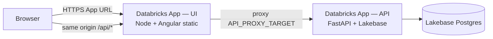

# Deploy Insights Hub UI to Databricks Apps

Step-by-step guide for packaging the **Angular UI** and deploying it as a **second Databricks App**, separate from the existing **FastAPI API** app (`app.yaml` at repo root).

**Related:**

- API + Lakebase: [LAKEBASE_POSTGRES_AND_DATABRICKS_APPS.md](./LAKEBASE_POSTGRES_AND_DATABRICKS_APPS.md)
- UI production server: [`UI/server.js`](../UI/server.js)
- UI Databricks manifest: [`UI/app.yaml`](../UI/app.yaml)

---

## Architecture (two apps)



| App | Name (example) | Runtime | Role |
|-----|----------------|---------|------|
| **API** | `edim-dde-ai-agents-api` | Python / uvicorn | REST at `/api/*`, Postgres, Databricks SDK |
| **UI** | `edim-dde-ai-agents-ui` | Node / Express | Static Angular + **reverse proxy** `/api` → API app URL |

**Why two apps?** You already deploy the API with root `app.yaml`. The UI is a separate Node workload (static files + proxy). Databricks Apps expose **one port per app** (`DATABRICKS_APP_PORT`); nginx (used in **Docker Compose** locally) is not available on the Databricks Apps runtime.

**Why proxy `/api`?** The Angular code uses a relative base:

```typescript
const API_BASE = '/api';  // UI/src/app/services/api.service.ts
```

Same-origin `/api` avoids CORS and matches local dev (`proxy.conf.json`) and Docker (`UI/nginx.conf`).

---

## Deployment options (choose one)

| Option | Apps | Complexity | Best when |
|--------|------|------------|-----------|
| **A — Two Databricks Apps** (this doc) | API + UI | Medium | Separate scaling, separate deploy cycles, your current direction |
| **B — Single app (FastAPI serves UI)** | API only | Lower | One URL, one deploy; mount `StaticFiles` in `API/src/main.py` |

This doc covers **Option A**. Option B is summarized in [Alternative: single app](#alternative-single-app-fastapi--static-ui).

---

## Prerequisites

| Requirement | Notes |
|-------------|-------|
| API app **Running** | Deploy FastAPI first; copy its **App URL** from the Databricks UI |
| Databricks CLI ≥ 0.256 | `databricks auth login --host https://adb-xxx.azuredatabricks.net` |
| Permission to create Apps | Workspace admin or delegated |
| Node 18+ locally | Build Angular (`npm run build`) |
| API app grants | UI app SP does **not** need Lakebase; it only proxies HTTP to the API app |

---

## Step 1 — Confirm API app is healthy

1. Open **Compute → Apps →** your API app (`edim-dde-ai-agents-api`).
2. Status must be **Running**.
3. Copy the **App URL** (e.g. `https://edim-dde-ai-agents-api-1234567890.us-east-1.databricksapps.com`).
4. Verify:
   - `{API_URL}/docs` — Swagger
   - `{API_URL}/api/health` — health check
   - `{API_URL}/api/environments` — seeded data

Keep this URL for **Step 4** (`API_PROXY_TARGET`).

---

## Step 2 — Build the Angular production bundle

From the repo root:

```bash
cd UI
npm ci
npm run build
```

**Output:** `UI/dist/cluster-advisor-ui/` (hashed JS/CSS + `index.html`).

> `dist/` is in `.gitignore`. You must **build before every UI deploy** (locally or in CI).

**Smoke-test locally (optional):**

```bash
# Terminal 1 — API on 8000
cd .. && uvicorn API.src.main:app --host 127.0.0.1 --port 8000

# Terminal 2 — UI production server
cd UI
npm install   # picks up express + http-proxy-middleware
API_PROXY_TARGET=http://127.0.0.1:8000 PORT=8080 npm run start:prod
```

Open `http://localhost:8080` — login and API calls should work via `/api` proxy.

---

## Step 3 — Configure `UI/app.yaml`

Edit [`UI/app.yaml`](../UI/app.yaml):

```yaml
command:
  - node
  - server.js

env:
  - name: NODE_ENV
    value: production
  - name: API_PROXY_TARGET
    value: "https://YOUR-API-APP-URL-FROM-STEP-1"
```

**Important:**

- Use the **API app base URL only** — no `/api` suffix, no trailing slash.
- Do **not** hardcode port `8000` in the UI manifest; `server.js` reads `DATABRICKS_APP_PORT`.
- Later, store the API URL in a **Databricks secret** and reference it with `valueFrom` (same pattern as API secrets in [LAKEBASE doc §Phase B](./LAKEBASE_POSTGRES_AND_DATABRICKS_APPS.md)).

---

## Step 4 — Create the UI Databricks App (workspace UI)

1. **Compute → Apps → Create app**
2. Name: `edim-dde-ai-agents-ui` (or your standard)
3. **Do not deploy yet**

### Permissions (typical)

| Identity | API app | UI app |
|----------|---------|--------|
| Developers | Can manage | Can manage |
| End users | Can use | Can use |

The UI app service principal only needs outbound HTTPS to the API app URL (platform handles this for Apps in the same workspace in most setups).

### Resources

The UI app **does not** need Lakebase, SQL warehouse, or secrets for a minimal deploy — only `API_PROXY_TARGET` in `app.yaml`.

---

## Step 5 — Upload source and deploy

### Option 5a — Deploy script (recommended)

From the repo root:

```bash
chmod +x scripts/deploy-databricks-ui.sh   # once

API_PROXY_TARGET=https://your-api-app.databricksapps.com \
WORKSPACE_USER=you@company.com \
CREATE_APP=1 \
./scripts/deploy-databricks-ui.sh
```

The script will:

1. `npm ci && npm run build` in `UI/`
2. Assemble a **slim runtime bundle** under `deploy/databricks-ui/` (static `dist/`, `server.js`, minimal `package.json`, generated `app.yaml`)
3. `databricks sync` → workspace path
4. `databricks apps deploy`

**Optional env vars:** `UI_WS_PATH`, `DATABRICKS_UI_APP_NAME`, `DATABRICKS_PROFILE`, `SKIP_BUILD=1`, `SKIP_SYNC=1`, `DEPLOY_MODE=full` (sync entire `UI/` folder instead of slim bundle).

### Option 5b — Manual `databricks sync`

```bash
# From repo root — after UI build (Step 2)
export WORKSPACE_USER="you@company.com"
export UI_WS_PATH="/Workspace/Users/${WORKSPACE_USER}/edim-dde-ai-agents-ui"

databricks sync as sync UI "${UI_WS_PATH}"

# First time only
databricks apps create edim-dde-ai-agents-ui

# Deploy / redeploy
databricks apps deploy edim-dde-ai-agents-ui --source-code-path "${UI_WS_PATH}"
```

Wait until status is **Running** (2–5 minutes).

### Option 5c — Git-connected app

1. App → **Settings → Git** → connect repo + branch.
2. Set **Source code path** to `UI` (subfolder).
3. Ensure CI or manual step runs `npm ci && npm run build` **before** deploy, or use a pipeline that commits `dist/` to a deploy branch (not recommended for main).

Databricks detects `package.json` in `UI/` and runs `npm install` on deploy. The **`command` in `app.yaml` overrides** default `npm run start`.

---

## Step 6 — Verify end-to-end

| # | Check | Expected |
|---|-------|----------|
| 1 | UI App URL loads | Login page (Insights Hub) |
| 2 | Browser devtools → Network | `GET /api/environments` → 200 (via proxy) |
| 3 | Navigate Workspaces / Jobs | Data loads for selected environment |
| 4 | UI app logs | `Insights Hub UI on 0.0.0.0:...; /api -> https://...` |

```bash
databricks apps logs edim-dde-ai-agents-ui
```

### Common failures

| Symptom | Cause | Fix |
|---------|-------|-----|
| Blank page / 404 on refresh | `dist/` missing at deploy | Run `npm run build` before sync |
| `Cannot GET /api/...` or 502 | Wrong `API_PROXY_TARGET` | Use exact API **App URL** from Databricks |
| API works, UI 500 on startup | `npm install` failed / no `express` | Run `npm ci` locally; sync after `npm ci --omit=dev` or let platform install |
| CORS errors | UI calling API URL directly | Keep `API_BASE = '/api'`; fix proxy, not CORS |
| App stuck **Deploying** | Invalid `app.yaml` | Validate YAML; test `node server.js` locally |

---

## Step 7 — Redeploy workflow (day 2)

```bash
API_PROXY_TARGET=https://your-api-app.databricksapps.com \
WORKSPACE_USER=you@company.com \
./scripts/deploy-databricks-ui.sh
```

Or manually:

```bash
cd UI
npm run build
databricks sync UI "${UI_WS_PATH}"
databricks apps deploy edim-dde-ai-agents-ui --source-code-path "${UI_WS_PATH}"
```

Only redeploy the **API** app when backend changes; only redeploy the **UI** app when Angular changes.

---

## What gets packaged (UI deploy folder)

Minimum files Databricks needs under the synced `UI/` path:

```text
UI/
  app.yaml              # Databricks Apps manifest
  server.js             # Express static + /api proxy
  package.json
  package-lock.json
  node_modules/         # created by platform on deploy OR sync after npm ci --omit=dev
  dist/
    cluster-advisor-ui/ # ng build output (required)
      index.html
      *.js
      *.css
```

**Do not sync** `node_modules` from a laptop if avoidable — let Databricks run `npm install`, or CI run `npm ci --omit=dev` and sync a slim bundle.

**Exclude from sync** (optional `.gitignore`-style via sync config):

- `.angular/cache`
- `src/` (not needed at runtime if `dist/` present)

---

## Slim deploy bundle (optional, faster uploads)

For smaller sync payloads, build a deploy folder:

```bash
cd UI
npm ci
npm run build
npm ci --omit=dev

mkdir -p ../deploy/databricks-ui/dist
cp app.yaml server.js package.json package-lock.json ../deploy/databricks-ui/
cp -r dist/cluster-advisor-ui ../deploy/databricks-ui/dist/
cp -r node_modules ../deploy/databricks-ui/

databricks sync deploy/databricks-ui "${UI_WS_PATH}"
databricks apps deploy edim-dde-ai-agents-ui --source-code-path "${UI_WS_PATH}"
```

---

## Alternative: single app (FastAPI + static UI)

If you prefer **one App URL** (no second app, no proxy env var):

1. Build UI: `cd UI && npm run build`
2. In `API/src/main.py`, mount static files **after** API routers:

```python
from pathlib import Path
from fastapi.staticfiles import StaticFiles

UI_DIST = Path(__file__).resolve().parents[2] / "UI" / "dist" / "cluster-advisor-ui"

if UI_DIST.is_dir():
    app.mount("/", StaticFiles(directory=str(UI_DIST), html=True), name="ui")
```

3. Include `UI/dist/cluster-advisor-ui/` in the **API** sync package (root `app.yaml` unchanged).
4. Users open the same URL as Swagger — `/` is the UI, `/api/*` is the API.

**Trade-off:** Every UI change redeploys the API app; bundle size grows (~2 MB static assets).

---

## Comparison to local Docker

| Layer | Docker Compose | Databricks Apps |
|-------|----------------|-----------------|
| UI server | nginx (`UI/Dockerfile`) | Node `server.js` |
| API proxy | `proxy_pass http://api:8000` | `http-proxy-middleware` → `API_PROXY_TARGET` |
| API server | uvicorn in `api` container | Separate Databricks App |
| Port | UI `:8080`, API `:8000` | One port per app (`DATABRICKS_APP_PORT`) |

---

## Security notes

- Both apps inherit **Databricks Apps authentication** (workspace users must have access).
- Do not embed Databricks PATs or API keys in the Angular bundle.
- `API_PROXY_TARGET` is server-side only (not exposed to the browser).
- For production LLM/Search keys, keep them on the **API app** via secret scopes (already documented for API `app.yaml`).

---

## Checklist summary

- [ ] API app deployed and **Running**
- [ ] API App URL copied
- [ ] `UI/app.yaml` → `API_PROXY_TARGET` set
- [ ] `cd UI && npm ci && npm run build`
- [ ] Databricks App `edim-dde-ai-agents-ui` created
- [ ] `databricks sync UI` → workspace path
- [ ] `databricks apps deploy edim-dde-ai-agents-ui`
- [ ] UI App URL loads; `/api/environments` returns JSON

---

## Changelog

| Date | Change |
|------|--------|
| 2026-06-30 | Initial UI deploy guide; `UI/server.js`, `UI/app.yaml` |
