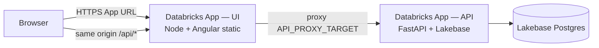

# Deploy Insights Hub UI to Databricks Apps

Step-by-step guide for packaging the **Angular UI** and deploying it as a **second Databricks App**, separate from the existing **FastAPI API** app (`app.yaml` at repo root).

**Related:**

- API + Lakebase: [LAKEBASE_POSTGRES_AND_DATABRICKS_APPS.md](./LAKEBASE_POSTGRES_AND_DATABRICKS_APPS.md)
- UI production server: [`UI/server.js`](../UI/server.js)
- UI Databricks manifest: [`UI/app.yaml`](../UI/app.yaml)

---

## Architecture (two apps)



| App | Name (example) | Runtime | Role |
|-----|----------------|---------|------|
| **API** | `edim-dde-ai-agents-api` | Python / uvicorn | REST at `/api/*`, Postgres, Databricks SDK |
| **UI** | `edim-dde-ai-agents-ui` | Node / Express | Static Angular + **reverse proxy** `/api` → API app URL |

**Why two apps?** You already deploy the API with root `app.yaml`. The UI is a separate Node workload (static files + proxy). Databricks Apps expose **one port per app** (`DATABRICKS_APP_PORT`); nginx (used in **Docker Compose** locally) is not available on the Databricks Apps runtime.

**Why proxy `/api`?** The Angular code uses a relative base:

```typescript
const API_BASE = '/api';  // UI/src/app/services/api.service.ts
```

Same-origin `/api` avoids CORS and matches local dev (`proxy.conf.json`) and Docker (`UI/nginx.conf`).

---

## Deployment options (choose one)

| Option | Apps | Complexity | Best when |
|--------|------|------------|-----------|
| **A — Two Databricks Apps** (this doc) | API + UI | Medium | Separate scaling, separate deploy cycles, your current direction |
| **B — Single app (FastAPI serves UI)** | API only | Lower | One URL, one deploy; mount `StaticFiles` in `API/src/main.py` |

This doc covers **Option A**. Option B is summarized in [Alternative: single app](#alternative-single-app-fastapi--static-ui).

---

## Prerequisites

| Requirement | Notes |
|-------------|-------|
| API app **Running** | Deploy FastAPI first; copy its **App URL** from the Databricks UI |
| Databricks CLI ≥ 0.256 | `databricks auth login --host https://adb-xxx.azuredatabricks.net` |
| Permission to create Apps | Workspace admin or delegated |
| Node 18+ locally | Build Angular (`npm run build`) |
| API app grants | UI app SP does **not** need Lakebase; it only proxies HTTP to the API app |

---

## Step 1 — Confirm API app is healthy

1. Open **Compute → Apps →** your API app (`edim-dde-ai-agents-api`).
2. Status must be **Running**.
3. Copy the **App URL** (e.g. `https://edim-dde-ai-agents-api-1234567890.us-east-1.databricksapps.com`).
4. Verify:
   - `{API_URL}/docs` — Swagger
   - `{API_URL}/api/health` — health check
   - `{API_URL}/api/environments` — seeded data

Keep this URL for **Step 4** (`API_PROXY_TARGET`).

---

## Step 2 — Build the Angular production bundle

From the repo root:

```bash
cd UI
npm ci
npm run build
```

**Output:** `UI/dist/cluster-advisor-ui/` (hashed JS/CSS + `index.html`).

> `dist/` is in `.gitignore`. You must **build before every UI deploy** (locally or in CI).

**Smoke-test locally (optional):**

```bash
# Terminal 1 — API on 8000
cd .. && uvicorn API.src.main:app --host 127.0.0.1 --port 8000

# Terminal 2 — UI production server
cd UI
npm install   # picks up express + http-proxy-middleware
API_PROXY_TARGET=http://127.0.0.1:8000 PORT=8080 npm run start:prod
```

Open `http://localhost:8080` — login and API calls should work via `/api` proxy.

---

## Step 3 — Configure `UI/app.yaml`

Edit [`UI/app.yaml`](../UI/app.yaml):

```yaml
command:
  - node
  - server.js

env:
  - name: NODE_ENV
    value: production
  - name: API_PROXY_TARGET
    value: "https://YOUR-API-APP-URL-FROM-STEP-1"
```

**Important:**

- Use the **API app base URL only** — no `/api` suffix, no trailing slash.
- Do **not** hardcode port `8000` in the UI manifest; `server.js` reads `DATABRICKS_APP_PORT`.
- Later, store the API URL in a **Databricks secret** and reference it with `valueFrom` (same pattern as API secrets in [LAKEBASE doc §Phase B](./LAKEBASE_POSTGRES_AND_DATABRICKS_APPS.md)).

---

## Step 4 — Create the UI Databricks App (workspace UI)

1. **Compute → Apps → Create app**
2. Name: `edim-dde-ai-agents-ui` (or your standard)
3. **Do not deploy yet**

### Permissions (typical)

| Identity | API app | UI app |
|----------|---------|--------|
| Developers | Can manage | Can manage |
| End users | Can use | Can use |

The UI app service principal only needs outbound HTTPS to the API app URL (platform handles this for Apps in the same workspace in most setups).

### Resources

The UI app **does not** need Lakebase, SQL warehouse, or secrets for a minimal deploy — only `API_PROXY_TARGET` in `app.yaml`.

---

## Step 5 — Upload source and deploy

### Option 5a — Databricks workspace UI (no CLI)

You can create, configure, and deploy the UI app entirely from the **Databricks workspace UI**. You still **build the Angular bundle on your laptop** (Databricks does not run `ng build` for you unless you add CI).

**Two UI paths:**

| Path | Best for |
|------|----------|
| **A — Workspace folder** | First deploy, air-gapped upload, no Git integration |
| **B — Git repository** | Repeatable deploys from a branch; optional auto-deploy on push |

---

#### Prepare the deploy bundle locally (both paths)

Run once before every UI deploy:

```bash
cd UI
npm ci
npm run build
```

Then stage the runtime bundle (pick one):

```bash
# A — Use deploy script (requires databricks CLI; stops before sync if you Ctrl+C after "Preparing slim")
API_PROXY_TARGET=https://your-api-app.databricksapps.com \
WORKSPACE_USER=you@company.com \
./scripts/deploy-databricks-ui.sh
# Upload deploy/databricks-ui/ via Workspace Import instead of letting sync finish — or use Path B Git

# B — Manual copy after build (no CLI)
mkdir -p deploy/databricks-ui/dist/cluster-advisor-ui
cp UI/server.js deploy/databricks-ui/
cp -R UI/dist/cluster-advisor-ui/. deploy/databricks-ui/dist/cluster-advisor-ui/
# Write app.yaml + minimal package.json — see scripts/deploy-databricks-ui.sh or UI/app.yaml
cd deploy/databricks-ui && npm install --omit=dev
```

```text
deploy/databricks-ui/
  app.yaml          # command: node server.js + API_PROXY_TARGET
  server.js
  package.json      # express + http-proxy-middleware only
  package-lock.json # optional; platform can npm install
  node_modules/     # optional; run npm install --omit=dev here
  dist/cluster-advisor-ui/
    index.html
    *.js, *.css
```

> **Upload this folder**, not raw `UI/src/` — the runtime needs **built** static files in `dist/`.

---

#### Path A — Deploy from a workspace folder (UI steps)

**1. Upload files to Workspace**

1. In Databricks: **Workspace** (left rail) → your user folder (e.g. `/Users/you@company.com/`).
2. Create folder: `edim-dde-ai-agents-ui`.
3. Upload the contents of `deploy/databricks-ui/`:
   - **Workspace UI:** right-click folder → **Import** → upload files/folders.
   - Or drag-and-drop if your workspace supports it.
4. Confirm these files exist at the folder root:
   - `app.yaml`, `server.js`, `package.json`
   - `dist/cluster-advisor-ui/index.html`

**2. Create the app**

1. **Compute → Apps** (or app switcher → **Databricks Apps**).
2. **+ Create app** → **Create a custom app**.
3. **Name:** `edim-dde-ai-agents-ui`.
4. Skip Git configuration if prompted (workspace-folder deploy).
5. **Create** (do not deploy yet if you want to set permissions first).

**3. Permissions (optional but recommended)**

1. Open the app → **Permissions**.
2. Grant your team **Can manage**; end users **Can use**.
3. No Lakebase / SQL warehouse resources needed for the UI app.

**4. Environment variables (optional alternative to `app.yaml`)**

You can set `API_PROXY_TARGET` in the UI instead of editing `app.yaml`:

1. App → **Environment** tab.
2. **+ Add variable**:
   - **Name:** `API_PROXY_TARGET`
   - **Value:** `https://your-api-app-….databricksapps.com` (API App URL, no trailing slash)
3. **+ Add variable:** `NODE_ENV` = `production` (optional if already in `app.yaml`).

If both `app.yaml` and the Environment tab define the same variable, prefer one source to avoid confusion (Environment tab overrides are common — check app logs if proxy fails).

**5. Deploy**

1. On the app overview page, click **Deploy**.
2. Choose **From workspace** (or **Workspace folder** — label varies by platform).
3. Browse to `/Workspace/Users/you@company.com/edim-dde-ai-agents-ui` (your upload path).
4. Click **Deploy** / **Select**.

**6. Wait and verify**

1. Status should become **Running** (2–5 minutes).
2. Copy the **App URL** from the overview page.
3. Open the URL → Insights Hub login page.
4. App → **Logs** tab: look for  
   `Insights Hub UI on 0.0.0.0:…; /api -> https://…`
5. Browser DevTools → Network → `GET /api/environments` should return **200**.

**7. Redeploy after UI changes**

1. Locally: `npm run build` (and refresh `deploy/databricks-ui/`).
2. Re-upload changed files to the same workspace folder (at minimum `dist/`).
3. App overview → **Deploy** → same workspace folder → **Deploy** again.

---

#### Path B — Deploy from Git (UI steps)

Use this when the repo (or a deploy branch) contains the **runtime bundle** including `dist/`.

**Git caveat for this repo:** `dist/` is **gitignored**. A deploy from `UI/` on `main` **will fail** unless you either:

- Push `dist/` on a **`deploy/ui`** branch (CI builds and commits artifacts), or
- Use **Path A** (workspace upload), or
- Use the **CLI script** locally.

**1. Prepare Git (one-time)**

1. Create branch `deploy/ui` (example).
2. CI or manual step runs `npm ci && npm run build` and commits:
   - `deploy/databricks-ui/` contents **or** `UI/` with `dist/` included on that branch only.
3. Ensure `app.yaml` at the deploy root has a real `API_PROXY_TARGET` (or set via Environment tab).

**2. Configure Git on the app**

1. **Compute → Apps → + Create app** (or edit existing).
2. **Configure Git:**
   - **Repository URL:** your GitHub/GitLab/Bitbucket URL.
   - **Provider:** GitHub / GitLab / etc.
3. For **private repos:** app → note **Git credential** prompt → **Configure Git credential** for the app service principal ([Connect Git provider](https://docs.databricks.com/aws/en/repos/get-started)).

**3. Deploy from Git**

1. App overview → **Deploy**.
2. Select **From Git**.
3. **Git reference:** branch name (e.g. `deploy/ui`) or tag/commit SHA.
4. **Source code path:** `deploy/databricks-ui` (or `UI` if bundle lives there).
5. **Deploy**.

**4. Optional — auto-deploy on push (Beta)**

When creating/editing the app, enable **Auto deploy on push** for the branch (GitHub only in some workspaces). Each push to that branch triggers a redeploy.

---

#### UI vs CLI — same outcome

| Step | CLI (`deploy-databricks-ui.sh`) | Databricks UI |
|------|----------------------------------|---------------|
| Build Angular | Script runs `npm run build` | You run locally |
| Stage bundle | `deploy/databricks-ui/` | Same folder; upload or Git push |
| Upload | `databricks sync` | Workspace Import or Git pull on deploy |
| Create app | `CREATE_APP=1` or UI | **Create app** |
| Set API URL | `API_PROXY_TARGET` / `app.yaml` | `app.yaml` or **Environment** tab |
| Deploy | `databricks apps deploy` | **Deploy** button |
| Logs | `databricks apps logs` | App → **Logs** tab |

Reference: [Deploy a Databricks app](https://docs.databricks.com/aws/en/dev-tools/databricks-apps/deploy) (workspace folder + Git).

---

### Option 5b — Deploy script (CLI)

From the repo root:

```bash
chmod +x scripts/deploy-databricks-ui.sh   # once

API_PROXY_TARGET=https://your-api-app.databricksapps.com \
WORKSPACE_USER=you@company.com \
CREATE_APP=1 \
./scripts/deploy-databricks-ui.sh
```

The script will:

1. `npm ci && npm run build` in `UI/`
2. Assemble a **slim runtime bundle** under `deploy/databricks-ui/` (static `dist/`, `server.js`, minimal `package.json`, generated `app.yaml`)
3. `databricks sync` → workspace path
4. `databricks apps deploy`

**Optional env vars:** `UI_WS_PATH`, `DATABRICKS_UI_APP_NAME`, `DATABRICKS_PROFILE`, `SKIP_BUILD=1`, `SKIP_SYNC=1`, `DEPLOY_MODE=full` (sync entire `UI/` folder instead of slim bundle).

### Option 5c — Manual `databricks sync` (CLI)

```bash
# From repo root — after UI build (Step 2)
export WORKSPACE_USER="you@company.com"
export UI_WS_PATH="/Workspace/Users/${WORKSPACE_USER}/edim-dde-ai-agents-ui"

# Git Bash on Windows: prevent /Workspace → C:/Program Files/Git/Workspace
export MSYS_NO_PATHCONV=1

databricks sync deploy/databricks-ui "${UI_WS_PATH}"

# First time only
databricks apps create edim-dde-ai-agents-ui

# Deploy / redeploy
databricks apps deploy edim-dde-ai-agents-ui --source-code-path "${UI_WS_PATH}"
```

Wait until status is **Running** (2–5 minutes).

### Option 5d — Git-connected app (CLI or UI)

1. App → **Settings → Git** → connect repo + branch.
2. Set **Source code path** to `UI` (subfolder).
3. Ensure CI or manual step runs `npm ci && npm run build` **before** deploy, or use a pipeline that commits `dist/` to a deploy branch (not recommended for main).

Databricks detects `package.json` in `UI/` and runs `npm install` on deploy. The **`command` in `app.yaml` overrides** default `npm run start`.

---

## Step 6 — Verify end-to-end

| # | Check | Expected |
|---|-------|----------|
| 1 | UI App URL loads | Login page (Insights Hub) |
| 2 | Browser devtools → Network | `GET /api/environments` → 200 (via proxy) |
| 3 | Navigate Workspaces / Jobs | Data loads for selected environment |
| 4 | UI app logs | `Insights Hub UI on 0.0.0.0:...; /api -> https://...` |

```bash
databricks apps logs edim-dde-ai-agents-ui
```

### Common failures

| Symptom | Cause | Fix |
|---------|-------|-----|
| Blank page / 404 on refresh | `dist/` missing at deploy | Run `npm run build` before sync |
| `Cannot GET /api/...` or 502 | Wrong `API_PROXY_TARGET` | Use exact API **App URL** from Databricks |
| API works, UI 500 on startup | `npm install` failed / no `express` | Run `npm ci` locally; sync after `npm ci --omit=dev` or let platform install |
| CORS errors | UI calling API URL directly | Keep `API_BASE = '/api'`; fix proxy, not CORS |
| Deploy: **no files found** / SP access | Empty folder or app SP cannot read folder | [Fix: no files found](#fix-deploy-no-files-found--service-principal-access) |
| App built OK then **http-proxy-middleware** crash | Stale **server.js** or **node_modules** on workspace from prior deploy | Delete workspace folder; redeploy with updated script (`CLEAN_WORKSPACE=1` default). Verify: `grep http-proxy-middleware UI/server.js` should only match comments |
| App stuck **Deploying** | Invalid `app.yaml` | Validate YAML; test `node server.js` locally |
| Sync path `C:/Program Files/Git/Workspace/...` | **Git Bash** rewrote `/Workspace/...` | Use **PowerShell**, or re-run `./scripts/deploy-databricks-ui.sh` (script sets `MSYS_NO_PATHCONV=1`), or `export MSYS_NO_PATHCONV=1` before `databricks sync` |

---

## Step 7 — Redeploy workflow (day 2)

```bash
API_PROXY_TARGET=https://your-api-app.databricksapps.com \
WORKSPACE_USER=you@company.com \
./scripts/deploy-databricks-ui.sh
```

Or manually:

```bash
cd UI
npm run build
databricks sync UI "${UI_WS_PATH}"
databricks apps deploy edim-dde-ai-agents-ui --source-code-path "${UI_WS_PATH}"
```

Only redeploy the **API** app when backend changes; only redeploy the **UI** app when Angular changes.

---

## Fix: deploy “no files found” / Service Principal access

This error at **`databricks apps deploy`** usually means one of two things:

1. **The workspace folder is empty** (sync went to the wrong path or failed silently).
2. **The app’s service principal cannot read** the folder (most common after sync succeeds).

### Step 1 — Confirm files exist

In **PowerShell** (recommended on Windows):

```powershell
databricks workspace list /Workspace/Users/you@org.com/edim-dde-ai-agents-ui
```

You should see at least: `app.yaml`, `server.js`, `package.json`, `dist`, `node_modules`.

If the list is **empty**:

- `WORKSPACE_USER` must match the **same email** as your CLI login (check `databricks auth describe`).
- Re-sync with path conversion disabled:

```powershell
$env:WORKSPACE_USER = "you@org.com"
$UI_WS_PATH = "/Workspace/Users/$env:WORKSPACE_USER/edim-dde-ai-agents-ui"
databricks sync deploy/databricks-ui $UI_WS_PATH
```

### Step 2 — Grant the app service principal access to the folder

Each Databricks App runs as its **own service principal**. That identity must be able to **read** the source folder.

**A. Find the app service principal**

1. **Compute → Apps →** `edim-dde-ai-agents-ui`
2. Open the **Environment** tab (or **Overview**)
3. Note **`DATABRICKS_CLIENT_ID`** (UUID) — this is the app’s service principal

**B. Share the workspace folder (UI)**

1. **Workspace** → browse to  
   `/Users/you@org.com/edim-dde-ai-agents-ui`
2. Click the **⋮** menu on the folder (or **Share**)
3. **Add** the app service principal:
   - Search by the **client id** UUID, or the app name if it appears
4. Permission: **Can Read** (minimum) or **Can Manage**
5. **Save**

**C. Redeploy**

```powershell
databricks apps deploy edim-dde-ai-agents-ui `
  --source-code-path /Workspace/Users/you@org.com/edim-dde-ai-agents-ui
```

Or from the app UI: **Deploy** → select the same workspace folder → **Deploy**.

### Step 3 — Alternative: use `/Workspace/Shared/` (team deploys)

If user-folder ACLs are awkward:

1. Sync to `/Workspace/Shared/edim-dde-ai-agents-ui`
2. Grant the app SP **Can Read** on that Shared folder
3. Deploy with `--source-code-path /Workspace/Shared/edim-dde-ai-agents-ui`

### Step 4 — First deploy from UI (often easiest)

After sync + folder permissions:

1. **Apps →** your UI app → **Deploy**
2. **From workspace** → select the folder that contains `app.yaml`
3. **Deploy**

The UI deploy flow sometimes resolves path/permission issues that CLI-only deploy hits on first run.

---

## Fix: http-proxy-middleware crash after “App built successfully”

The repo **no longer uses** `http-proxy-middleware`. If you still see:

```text
Cannot find module '.../http-proxy-middleware/dist/index.js'
```

the workspace almost certainly has **old `server.js`** (and/or stale `node_modules`) from a previous deploy. Sync alone may not replace them.

### Step 1 — Confirm your local copy is fixed

```powershell
Select-String -Path UI\server.js -Pattern "require\('http-proxy-middleware'\)"
# Should return NOTHING

Select-String -Path UI\server.js -Pattern "require\('http'\)"
# Should match (native proxy)
```

If the first command matches, run `git pull` to get the latest `UI/server.js`.

### Step 2 — Delete the workspace deploy folder

In **Databricks Workspace UI**:

1. Browse to `/Users/you@org.com/edim-dde-ai-agents-ui`
2. **Delete the entire folder** (or delete at least `server.js` and `node_modules`)

Or CLI:

```powershell
databricks workspace delete /Workspace/Users/you@org.com/edim-dde-ai-agents-ui --recursive
```

### Step 3 — Redeploy with cleanup (updated script)

```powershell
$env:API_PROXY_TARGET = "https://your-api-app.databricksapps.com"
$env:WORKSPACE_USER = "you@org.com"
$env:CLEAN_WORKSPACE = "1"

bash ./scripts/deploy-databricks-ui.sh
```

The script now:

- Verifies staging `server.js` has **no** `http-proxy-middleware` require
- **Deletes** the workspace folder before sync (default)
- Syncs **without** `node_modules` (Databricks runs `npm install` for express only)
- **Exports** `server.js` from workspace after sync to verify it updated

### Step 4 — Confirm app deploy source

In **Apps → edim-dde-ai-agents-ui → Deploy**:

- Use **From workspace** (not Git) unless your Git branch has the fixed `server.js`
- If the app is Git-backed, push the fix to that branch or switch to workspace deploy

### Step 5 — Check logs after deploy

Success line:

```text
Insights Hub UI on 0.0.0.0:...; /api -> https://...
```

---

## What gets packaged (UI deploy folder)

Minimum files Databricks needs under the synced `UI/` path:

```text
UI/
  app.yaml              # Databricks Apps manifest
  server.js             # Express static + /api proxy
  package.json
  package-lock.json
  node_modules/         # created by platform on deploy OR sync after npm ci --omit=dev
  dist/
    cluster-advisor-ui/ # ng build output (required)
      index.html
      *.js
      *.css
```

**Do not sync** `node_modules` from a laptop if avoidable — let Databricks run `npm install`, or CI run `npm ci --omit=dev` and sync a slim bundle.

**Exclude from sync** (optional `.gitignore`-style via sync config):

- `.angular/cache`
- `src/` (not needed at runtime if `dist/` present)

---

## Slim deploy bundle (optional, faster uploads)

For smaller sync payloads, build a deploy folder:

```bash
cd UI
npm ci
npm run build
npm ci --omit=dev

mkdir -p ../deploy/databricks-ui/dist
cp app.yaml server.js package.json package-lock.json ../deploy/databricks-ui/
cp -r dist/cluster-advisor-ui ../deploy/databricks-ui/dist/
cp -r node_modules ../deploy/databricks-ui/

databricks sync deploy/databricks-ui "${UI_WS_PATH}"
databricks apps deploy edim-dde-ai-agents-ui --source-code-path "${UI_WS_PATH}"
```

---

## Alternative: single app (FastAPI + static UI)

If you prefer **one App URL** (no second app, no proxy env var):

1. Build UI: `cd UI && npm run build`
2. In `API/src/main.py`, mount static files **after** API routers:

```python
from pathlib import Path
from fastapi.staticfiles import StaticFiles

UI_DIST = Path(__file__).resolve().parents[2] / "UI" / "dist" / "cluster-advisor-ui"

if UI_DIST.is_dir():
    app.mount("/", StaticFiles(directory=str(UI_DIST), html=True), name="ui")
```

3. Include `UI/dist/cluster-advisor-ui/` in the **API** sync package (root `app.yaml` unchanged).
4. Users open the same URL as Swagger — `/` is the UI, `/api/*` is the API.

**Trade-off:** Every UI change redeploys the API app; bundle size grows (~2 MB static assets).

---

## Comparison to local Docker

| Layer | Docker Compose | Databricks Apps |
|-------|----------------|-----------------|
| UI server | nginx (`UI/Dockerfile`) | Node `server.js` |
| API proxy | `proxy_pass http://api:8000` | `http-proxy-middleware` → `API_PROXY_TARGET` |
| API server | uvicorn in `api` container | Separate Databricks App |
| Port | UI `:8080`, API `:8000` | One port per app (`DATABRICKS_APP_PORT`) |

---

## Security notes

- Both apps inherit **Databricks Apps authentication** (workspace users must have access).
- Do not embed Databricks PATs or API keys in the Angular bundle.
- `API_PROXY_TARGET` is server-side only (not exposed to the browser).
- For production LLM/Search keys, keep them on the **API app** via secret scopes (already documented for API `app.yaml`).

---

## Checklist summary

- [ ] API app deployed and **Running**
- [ ] API App URL copied
- [ ] `UI/app.yaml` → `API_PROXY_TARGET` set
- [ ] `cd UI && npm ci && npm run build`
- [ ] Databricks App `edim-dde-ai-agents-ui` created
- [ ] `databricks sync UI` → workspace path
- [ ] `databricks apps deploy edim-dde-ai-agents-ui`
- [ ] UI App URL loads; `/api/environments` returns JSON

---

## Changelog

| Date | Change |
|------|--------|
| 2026-06-30 | Databricks UI deploy path (workspace folder + Git) |
| 2026-06-30 | Initial UI deploy guide; `UI/server.js`, `UI/app.yaml` |
