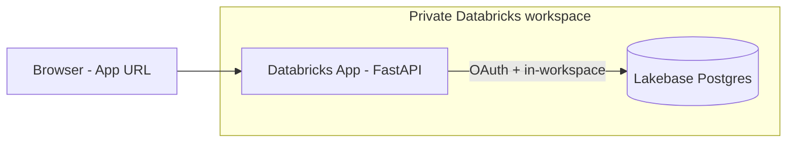
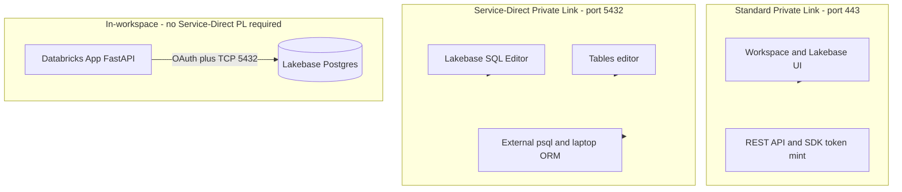

# Lakebase Postgres integration and Databricks Apps deployment

This document captures the Lakebase Postgres migration context for **EDIM DDE AI Agents**: current issues, alternative approaches, resolution steps, and an end-to-end guide for deploying the **API on Databricks Apps** connected to **Lakebase** in a **private-only** workspace.

**Related code and scripts:**

- `shared/database/connection.py` — dual Postgres backend (`local` | `lakebase`) with OAuth token rotation
- `shared/config/settings.py` — `POSTGRES_BACKEND`, `POSTGRES_LAKEBASE_ENDPOINT`, Databricks SDK auth fields
- `scripts/lakebase_bootstrap_grants.sql` — OAuth role + schema grants for Databricks Apps service principal
- `.env.example` — local default
- `.env.lakebase.example` — Lakebase profile template

---

## Table of contents

1. [Background](#background)
2. [Current issues](#current-issues)
3. [Alternative solutions](#alternative-solutions)
4. [Configuration reference](#configuration-reference)
5. [Resolve external connection issues (step-by-step)](#resolve-external-connection-issues-step-by-step)
6. [Databricks Apps + Lakebase (recommended for private workspaces)](#databricks-apps--lakebase-recommended-for-private-workspaces)
7. [Local dual-mode development](#local-dual-mode-development)
8. [Database schema and migrations](#database-schema-and-migrations)
9. [Private-only workspaces: SQL Editor vs Apps vs external clients](#private-only-workspaces-sql-editor-vs-apps-vs-external-clients)
10. [Bootstrap database grants (Lakebase Apps)](#bootstrap-database-grants-lakebase-apps)
11. [Workspace admin runbook: Service-Direct Private Link](#workspace-admin-runbook-service-direct-private-link)
12. [Troubleshooting](#troubleshooting)
13. [Decision summary](#decision-summary)

---

## Background

The application persists platform state (environments, connections, recommendations history, request logs, etc.) in **PostgreSQL** via SQLAlchemy.

| Mode | Description |
|------|-------------|
| **Local (default)** | Docker Postgres on the developer machine; static username/password |
| **Lakebase** | Databricks Lakebase Autoscaling Postgres; **OAuth** tokens (1-hour TTL) minted via Databricks SDK |

Lakebase OAuth requires two distinct configuration concepts:

| Setting | Purpose | Example |
|---------|---------|---------|
| `POSTGRES_HOST` | TCP hostname for Postgres | `ep-abc-123.database.westus2.cloud.databricks.com` |
| `POSTGRES_LAKEBASE_ENDPOINT` | Lakebase API resource path for token minting | `projects/my-app/branches/production/endpoints/primary` |

The **connection string** from the Lakebase Connect dialog provides host, user, database, and SSL — but **not** the endpoint path. The endpoint path is required for `generate_database_credential()` in application code.

---

## Current issues

### Issue 1: DNS failure from developer laptops (`getaddrinfo failed`)

**Symptom:**

```text
(psycopg.OperationalError) [Errno 11001] getaddrinfo failed
database_initialization_failed
```

**Cause:** The machine running the API cannot resolve `POSTGRES_HOST` in DNS. This occurs **before** OAuth, SSL, or schema creation.

**Observed on:** Windows laptop, private-only Databricks workspace.

**`nslookup` result:**

```text
*** Unknown can't find host: Non-existent domain
```

**Root causes (one or more):**

1. **Wrong hostname** — placeholder (`ep-xxxx...`), workspace URL instead of Postgres host, or endpoint path used as host
2. **Private-only workspace** — Lakebase Autoscaling uses regional hostnames (`*.database.<region>.cloud.databricks.com`) that may not exist in public DNS when the workspace disallows public network access
3. **Missing Service-Direct Private Link** — external Postgres clients require **Inbound Private Link for performance-intensive services** (port 5432), separate from standard workspace Private Link (port 443)
4. **Docker Compose override** — `docker-compose.yml` forces `POSTGRES_HOST=postgres` for the `api` service, ignoring Lakebase settings in `.env`
5. **No VPN / private DNS** — laptop is off the corporate network that resolves Lakebase private hostnames

---

### Issue 2: `POSTGRES_LAKEBASE_ENDPOINT` not visible in UI

**Symptom:** Connect dialog shows a `postgresql://...` connection string but not the full `projects/.../endpoints/...` path.

**Cause:** Databricks separates **Postgres connection parameters** (for drivers) from **Lakebase control-plane resource names** (for OAuth token API).

**Resolution:** Use CLI or Connect modal “Get ID / Copy resource name” (see [Configuration reference](#configuration-reference)).

---

### Issue 3: OAuth token vs connection string

**Symptom:** Pasting a connection string into `.env` does not work long-term.

**Cause:** OAuth “password” is a **1-hour token**, not a static secret. Applications must call `WorkspaceClient().postgres.generate_database_credential(endpoint=...)` and refresh before expiry.

---

### Issue 4: Private Link scope confusion (two different endpoints)

Lakebase Autoscaling in a **private-only** workspace uses **two separate** Private Link paths. Confusing them is a common source of “it works in Apps but not in SQL Editor / psql” reports.

| Traffic | Port | Private Link type | Required in private-only workspace? |
|---------|------|-------------------|-------------------------------------|
| Workspace UI, REST API, SDK token minting | 443 | **Standard inbound** Private Link | Yes (existing workspace PL) |
| **Lakebase SQL Editor** and **Tables editor** | 5432 | **Service-Direct** / performance-intensive Private Link | **Yes** |
| Postgres clients (`psql`, SQLAlchemy) from **outside** workspace | 5432 | **Service-Direct** Private Link | **Yes** |
| **Databricks Apps → Lakebase** (in-workspace runtime) | 5432 | In-workspace path | **No** — does **not** require Service-Direct PL |

Reference: [Private Link for Lakebase Autoscaling](https://learn.microsoft.com/en-us/azure/databricks/oltp/projects/private-link)

**Key takeaway:** Deploying the API on **Databricks Apps** can succeed while the **Lakebase SQL Editor still fails** until admins configure Service-Direct Private Link. These are independent connectivity paths.

---

### Issue 5: Lakebase SQL Editor blocked — Service-Direct Private Link not configured

**Symptom (Lakebase project → SQL Editor):**

```text
Query failed due to Service Direct private link not being configured.
Contact your workspace admin to update this setting
```

**Also seen as:** “Failed to fetch”, “Unknown error” in SQL Editor or Tables editor.

**Cause:** The SQL Editor and Tables editor route database traffic through the same **regional performance-intensive ingress** (port **5432**) as external Postgres clients. In a workspace with **standard Private Link only** (port 443), the Lakebase UI can load, but **interactive SQL against Autoscaling compute cannot run** until **Inbound Private Link for performance-intensive services** (Service-Direct) is configured at the **account** level.

**Observed when:** Running bootstrap SQL (for example `scripts/lakebase_bootstrap_grants.sql`) from SQL Editor after the app failed with `permission denied for schema public`.

**Who can fix:** Account admin + network admin (not fixable from application code alone).

**Reference:** [Configure inbound Private Link for performance-intensive services](https://learn.microsoft.com/en-us/azure/databricks/security/network/front-end/service-direct-privatelink), [Query from Lakebase SQL Editor — Troubleshoot](https://learn.microsoft.com/en-us/azure/databricks/oltp/projects/sql-editor)

---

### Issue 6: App startup DDL fails — `permission denied for schema public`

**Symptom (Databricks App logs):**

```text
(psycopg2.errors.InsufficientPrivilege) permission denied for schema public
CREATE TABLE cost_usage_logs ...
event: database_initialization_failed
```

**Cause:** OAuth connected successfully, but the app service principal’s Postgres role lacks **`USAGE` and/or `CREATE` on schema `public`**. Lakebase OAuth roles do **not** inherit default schema permissions.

**Common triggers:**

1. Lakebase app resource added with **“Can connect”** only (not **“Can connect and create”**).
2. Resource was added before the app identity existed; role/grants were never applied.
3. Admin intended to run `scripts/lakebase_bootstrap_grants.sql` but **Issue 5** (SQL Editor blocked) prevented it.

**In-repo script:** `scripts/lakebase_bootstrap_grants.sql`

**Reference:** [Connect a custom Databricks app to Lakebase (tutorial)](https://docs.databricks.com/aws/en/oltp/projects/tutorial-databricks-apps-autoscaling)

---

### Issue 7: `WorkspaceClient` has no attribute `postgres` (Apps runtime SDK)

**Symptom:**

```text
WorkspaceClient object has no attribute postgres
event: database_initialization_failed
```

**Cause:** Databricks Apps runtime may ship an older `databricks-sdk` without `w.postgres.generate_database_credential()`.

**Fix (in code):** `shared/database/connection.py` falls back to `PostgresAPI` and REST `POST /api/2.0/postgres/credentials`. Ensure `requirements.txt` includes `databricks-sdk>=0.89.0` and redeploy.

---

## Alternative solutions

| Option | Best for | Pros | Cons |
|--------|----------|------|------|
| **A. Local Postgres (default dual mode)** | Day-to-day dev on laptops | No network setup; existing Docker flow | Not shared/cloud persistence |
| **B. Lakebase from laptop via Private Link + VPN** | Engineers connecting directly with `psql`/local API | Same code path as production DB | Requires network admin: Service-Direct PL, private DNS, VPN |
| **C. Databricks Apps + Lakebase resource** | Private-only workspaces | App runs in-workspace; platform injects PG vars and SP role; **no laptop DNS** | Requires Apps deploy; **SQL Editor may still need Service-Direct PL** for admin DDL |
| **D. API on Azure VM in VNet** | Teams avoiding Apps | Full control | More infra to manage; still need Private Link/DNS |
| **E. Native Postgres password on Lakebase** | Tools that cannot rotate OAuth | Static password | Often disabled on new projects; not aligned with OAuth identity model |
| **F. Service-Direct Private Link (admin)** | Private-only + SQL Editor / external psql | Enables Lakebase SQL Editor, Tables editor, laptop `psql` | Account + network project; separate from Apps deploy |

**Recommended strategy for this project:**

- **Developers:** Option A (`POSTGRES_BACKEND=local`)
- **Shared / private workspace — runtime API:** Option C (Databricks Apps)
- **Shared / private workspace — admin DDL / grants:** Option F (Service-Direct PL) **or** fix Lakebase app resource permissions (see [Bootstrap database grants](#bootstrap-database-grants-lakebase-apps))
- **Parallel track with admins:** Option B for direct laptop access (optional, later)

---

## Configuration reference

### Environment variables (application)

| Variable | Required when | Description |
|----------|---------------|-------------|
| `POSTGRES_BACKEND` | Always (Postgres enabled) | `local` (default) or `lakebase` |
| `POSTGRES_HOST` | Always | `localhost` (local) or Lakebase compute hostname |
| `POSTGRES_PORT` | Always | Default `5432` |
| `POSTGRES_USER` | Always | `postgres` (local) or Databricks identity email / SP client ID |
| `POSTGRES_PASSWORD` | `local` only | Static password |
| `POSTGRES_DATABASE` | Always | `ai_agents` (local) or `databricks_postgres` (Lakebase) |
| `POSTGRES_SSL_MODE` | Always | `prefer` (local) or `require` (Lakebase) |
| `POSTGRES_LAKEBASE_ENDPOINT` | `lakebase` | `projects/<id>/branches/<id>/endpoints/<id>` |
| `DATABRICKS_HOST` | `lakebase` (external) | Workspace URL for SDK; falls back to `https://{DATABRICKS_SERVER_HOSTNAME}` |
| `DATABRICKS_CLIENT_ID` / `SECRET` | CI / Docker without interactive login | Service principal OAuth for SDK |

Copy templates:

- Local: `.env.example`
- Lakebase profile: `.env.lakebase.example`

### Discover `POSTGRES_LAKEBASE_ENDPOINT` via CLI

```bash
databricks auth login --host https://adb-xxxx.azuredatabricks.net

databricks postgres list-projects
databricks postgres list-branches projects/<project-id>
databricks postgres list-endpoints projects/<project-id>/branches/<branch-id>
```

The `name` field in `list-endpoints` output **is** `POSTGRES_LAKEBASE_ENDPOINT`.

Get hostname:

```bash
databricks postgres get-endpoint \
  projects/<project-id>/branches/<branch-id>/endpoints/<endpoint-id> -o json
```

### Databricks Apps injected variables (when Lakebase is an app resource)

When a Lakebase database is attached as app resource key `postgres`:

| Injected | Maps to app setting |
|----------|---------------------|
| `PGHOST` | `POSTGRES_HOST` |
| `PGPORT` | `POSTGRES_PORT` |
| `PGDATABASE` | `POSTGRES_DATABASE` |
| `PGUSER` | `POSTGRES_USER` (app service principal client ID) |
| `PGSSLMODE` | `POSTGRES_SSL_MODE` |
| `valueFrom: postgres` | `POSTGRES_LAKEBASE_ENDPOINT` |

Reference: [Add a Lakebase resource to a Databricks app](https://docs.databricks.com/aws/en/dev-tools/databricks-apps/lakebase)

---

## Resolve external connection issues (step-by-step)

Use this when connecting from a **developer laptop** or **any client outside** the Databricks workspace (local API, `psql`, pgAdmin).

### Step 1 — Validate hostname

1. Open **Lakebase** app → your project → **Connect**.
2. Select branch, compute, database, OAuth mode.
3. Copy **hostname only** (e.g. `ep-abc-123.database.westus2.cloud.databricks.com`).
4. On the client machine:

   ```cmd
   nslookup ep-abc-123.database.westus2.cloud.databricks.com
   ```

   - **Non-existent domain** → proceed to Step 2 (network) or use Databricks Apps instead.
   - **Returns IP** → proceed to Step 3 (application config).

### Step 2 — Work with cloud / network / Databricks admins (private-only workspace)

Provide admins this checklist:

| # | Admin action | Owner |
|---|--------------|-------|
| 1 | Confirm workspace **public network access** is disabled (expected) | Databricks admin |
| 2 | Enable preview: **Private connectivity for performance-intensive services** | Account admin |
| 3 | Create **Inbound Private Link for performance-intensive services** (Service-Direct, port **5432**) | Network admin |
| 4 | Register private endpoint in **Databricks Account Console** | Account admin |
| 5 | Configure **private DNS** so `*.database.<region>.cloud.databricks.com` resolves to private endpoint IP | Network admin |
| 6 | Ensure developers use **VPN** (or VNet jump box) that uses the private DNS zone | Network admin |
| 7 | Allowlist [Databricks regional IPs](https://docs.databricks.com/aws/en/oltp/projects/connection-strings) on client firewalls if needed | Security / network |

Verify after setup:

```cmd
nslookup ep-abc-123.database.westus2.cloud.databricks.com
```

Expected: private IP (not public internet failure).

Reference: [Configure inbound Private Link for performance-intensive services](https://learn.microsoft.com/en-us/azure/databricks/oltp/infrastructure/configure-private-link-services)

### Step 3 — Configure application (Lakebase OAuth)

Merge into `.env` (see `.env.lakebase.example`):

```bash
USE_POSTGRES=true
POSTGRES_BACKEND=lakebase
POSTGRES_HOST=ep-xxxx.database.<region>.cloud.databricks.com
POSTGRES_PORT=5432
POSTGRES_USER=your.email@company.com
POSTGRES_DATABASE=databricks_postgres
POSTGRES_SSL_MODE=require
POSTGRES_LAKEBASE_ENDPOINT=projects/<project>/branches/<branch>/endpoints/<endpoint>
DATABRICKS_HOST=https://adb-xxxx.azuredatabricks.net
```

Authenticate SDK (interactive dev):

```bash
databricks auth login --host https://adb-xxxx.azuredatabricks.net
```

Smoke-test token minting:

```bash
databricks postgres generate-database-credential \
  projects/<project>/branches/<branch>/endpoints/<endpoint> --output json
```

### Step 4 — Run API on host (not Docker) for Lakebase testing

`docker-compose.yml` overrides `POSTGRES_HOST=postgres` for the `api` service. For Lakebase from a laptop:

```bash
# Terminal 1 — local Postgres not required for Lakebase test
pip install -r requirements.txt
uvicorn API.src.main:app --host 127.0.0.1 --port 8000 --reload
```

Check logs for `database_initialized` (not `database_initialization_failed`).

### Step 5 — Verify API health

```bash
curl http://127.0.0.1:8000/api/health
curl http://127.0.0.1:8000/api/environments
```

---

## Databricks Apps + Lakebase (recommended for private workspaces)

Deploy the **FastAPI API** inside the workspace. The app connects to Lakebase over the **in-workspace network path** — no laptop DNS or Service-Direct Private Link required for the app itself.



### Architecture overview

| Component | Role |
|-----------|------|
| **Databricks App** | Runs `uvicorn API.src.main:app` on platform-managed compute |
| **Lakebase app resource** | Creates SP Postgres role; injects `PG*` env vars |
| **`app.yaml`** | Startup command, env mapping, secret references |
| **Secret scopes** | Azure OpenAI / Search keys (Phase B) |
| **UI** | Phase C — serve static build from FastAPI or separate app |

### Prerequisites

| Requirement | Notes |
|-------------|-------|
| Databricks CLI ≥ 0.256 | `databricks auth login` |
| Permission to create Apps | Workspace admin or delegated |
| **CAN MANAGE** on Lakebase project | Required to attach DB as app resource |
| Lakebase project with active compute | Branch + endpoint (e.g. `production` / `primary`) |
| Git or `databricks sync` access | Deploy source to workspace files |

---

### Phase A — Create app and attach Lakebase (UI)

#### A1. Create the Databricks App

1. Workspace → **Compute** → **Apps** → **Create app**.
2. Name: `edim-dde-ai-agents-api` (or your standard).
3. **Do not deploy yet.**

#### A2. Note the app service principal

1. Open the app → **Environment** tab.
2. Copy **`DATABRICKS_CLIENT_ID`** (UUID).
3. This identity is used as `PGUSER` / `POSTGRES_USER` when the app runs.

When Lakebase is added as a resource (A3), Databricks typically creates the OAuth Postgres role and grants **`CONNECT`** and database-level **`CREATE`**. That is **not always sufficient** for SQLAlchemy `create_all()` on schema **`public`** — you may still need explicit schema grants (Issue 6) or **“Can connect and create”** on the resource.

#### A3. Add Lakebase database resource

1. App → **Resources** → **+ Add resource** → **Database**.
2. Select **Lakebase Autoscaling** → your **project → branch → database** (`databricks_postgres`).
3. Permission: **Can connect and create** (not “Can connect” only).
4. Resource key: **`postgres`** (default).

Databricks will:

- Create a Postgres role named after the app service principal client ID
- Grant **`CONNECT`** on the database and permissions needed for the resource level you selected
- Inject `PGHOST`, `PGPORT`, `PGDATABASE`, `PGUSER`, `PGSSLMODE` at runtime

**If startup still fails with `permission denied for schema public`:** run `scripts/lakebase_bootstrap_grants.sql` (requires SQL Editor or another Postgres client path — see [Bootstrap database grants](#bootstrap-database-grants-lakebase-apps)).

---

### Phase A — Prepare deployment package (repo)

Create a deploy folder (planned layout — implement in repo when ready):

```text
deploy/databricks-app/
  app.yaml
  requirements.txt       # trimmed from repo root
  API/
  AI/
  DE/
  shared/
  config/
  data/
    sample_job_metrics.csv
```

#### `app.yaml` example

Use the committed **`app.yaml`** at the repo root (or `app.minimal.yaml` for first smoke deploy).

```yaml
command:
  - uvicorn
  - API.src.main:app
  - --host
  - 0.0.0.0
  - --port
  - "8000"

env:
  - name: PYTHONPATH
    value: "."
  - name: USE_POSTGRES
    value: "true"
  - name: POSTGRES_BACKEND
    value: lakebase
  - name: POSTGRES_LAKEBASE_ENDPOINT
    valueFrom: postgres
  - name: CONFIG_DIR
    value: config
  - name: USE_LOCAL_DATA
    value: "true"
  - name: USE_MOCK_LLM
    value: "true"
```

**Notes:**

- **`PGHOST`, `PGUSER`, `PGDATABASE`, `PGPORT`, `PGSSLMODE`** are auto-injected when Lakebase is an app resource; `settings.py` maps them via `PGHOST` → `postgres_host`, etc.
- **`valueFrom: postgres`** requires a Lakebase **Database** resource with key **`postgres`** on the app.
- Do **not** use `$PGHOST` in `value` fields — not supported.

**Port:** Databricks Apps may set `DATABRICKS_APP_PORT`; `settings.api_port` reads it if you switch the uvicorn command to use that port later.

#### `requirements.txt` for Apps

Start from repo root `requirements.txt`. Consider **removing** for faster deploy if unused:

- `pyodbc`, `pymssql` (SQL Server — not used when `USE_POSTGRES=true`)
- `pytest*` (test-only)

Keep:

- `fastapi`, `uvicorn`, `sqlalchemy`, `psycopg2-binary`, `databricks-sdk`
- `langchain*`, `azure-*`, application dependencies

---

### Phase A — Sync and deploy (CLI)

```bash
# 1. Authenticate
databricks auth login --host https://adb-xxxx.azuredatabricks.net

# 2. Upload deploy folder to workspace
databricks sync deploy/databricks-app \
  /Workspace/Users/<you@company.com>/edim-dde-ai-agents-api

# 3. Deploy (first time: create app if not exists)
databricks apps create edim-dde-ai-agents-api   # once
databricks apps deploy edim-dde-ai-agents-api \
  --source-code-path /Workspace/Users/<you@company.com>/edim-dde-ai-agents-api
```

Wait 2–3 minutes until app status is **Running**. Open the **App URL** from the app overview page.

Alternative: connect a **Git repository** at app level and deploy from a branch/subfolder — see [Deploy a Databricks app](https://docs.databricks.com/aws/en/dev-tools/databricks-apps/deploy).

---

### Phase A — Verify end-to-end

| # | Check | Expected |
|---|-------|----------|
| 1 | App logs | `database_engine_created`, `postgres_backend=lakebase` |
| 2 | App logs | `database_initialized` (not `database_initialization_failed`) |
| 3 | Browser | `https://<app-url>/docs` — FastAPI Swagger loads |
| 4 | API | `GET /api/health` returns success |
| 5 | API | `GET /api/environments` returns seeded environments |
| 6 | Lakebase SQL Editor | Tables exist after first successful startup (`platform_environments`, etc.) — **only if SQL Editor is reachable** (Service-Direct PL in private-only workspaces) |

**First deploy on empty Lakebase:** API startup runs `init_database()` (`create_all`) and `seed_platform_environments_if_empty()`. **No SQL migration files required** for a greenfield database **if the app SP has schema DDL rights**. See [Database schema and migrations](#database-schema-and-migrations) and [Bootstrap database grants](#bootstrap-database-grants-lakebase-apps).

---

### Phase B — Production secrets and integrations

#### B1. Azure OpenAI (Databricks secret scope)

1. Create scope: `edim-dde-ai-agents-secrets`.
2. Store keys (Databricks CLI or UI):

   ```bash
   databricks secrets put-secret edim-dde-ai-agents-secrets azure-openai-endpoint
   databricks secrets put-secret edim-dde-ai-agents-secrets azure-openai-api-key
   ```

3. App → **Resources** → add **Secret** resources with **READ** permission.
4. Reference in `app.yaml`:

   ```yaml
   env:
     - name: AZURE_OPENAI_ENDPOINT
       valueFrom: azure-openai-endpoint
     - name: AZURE_OPENAI_API_KEY
       valueFrom: azure-openai-api-key
     - name: USE_MOCK_LLM
       value: "false"
   ```

#### B2. Databricks SQL warehouse (when `USE_LOCAL_DATA=false`)

1. App → **Resources** → **SQL warehouse** → grant **CAN USE**.
2. Set `DATABRICKS_HTTP_PATH` via resource reference or env.
3. App service principal auth may replace PAT (`DATABRICKS_TOKEN`) inside Apps — validate with your workspace policy.

#### B3. Azure AI Search (optional RAG)

Same secret-scope pattern for `AZURE_SEARCH_ENDPOINT`, `AZURE_SEARCH_API_KEY`, `AZURE_SEARCH_INDEX_NAME`.

#### B4. Databricks Asset Bundles (team CI/CD)

For repeatable deploys, add `databricks.yml` declaring app, Lakebase resource, secrets, and warehouse. Reference: [App configuration (DABs)](https://developers.databricks.com/docs/apps/configuration).

---

### Phase C — UI (future)

The Angular UI uses `API_BASE = '/api'`. Options:

| Option | Description |
|--------|-------------|
| **C1. API only** | Use Swagger (`/docs`) until UI is deployed |
| **C2. Static UI from FastAPI** | Build `UI/dist`, mount with `StaticFiles` in `API.src.main` |
| **C3. Second Databricks App** | Node/nginx app; configure proxy to API app URL |

Recommended: **C2** for single URL inside workspace auth boundary.

---

## Local dual-mode development

Engineers default to local Postgres; no Lakebase network required.

```bash
# .env
POSTGRES_BACKEND=local
POSTGRES_HOST=localhost
POSTGRES_USER=postgres
POSTGRES_PASSWORD=postgres
POSTGRES_DATABASE=ai_agents

docker compose up -d postgres
uvicorn API.src.main:app --host 127.0.0.1 --port 8000 --reload
```

Switch to Lakebase only when network path is available (VPN + Private Link) or test against deployed Databricks App URL instead of local API.

---

## Database schema and migrations

### Greenfield (empty Lakebase or first Apps deploy)

On API startup (`USE_POSTGRES=true`):

1. `init_database()` — SQLAlchemy `Base.metadata.create_all()`
2. `seed_platform_environments_if_empty()` — platform environments, default connections/datasets

**Lakebase prerequisite:** The app service principal must have **`USAGE` + `CREATE` on schema `public`** (or tables must already exist). See `scripts/lakebase_bootstrap_grants.sql` and [Bootstrap database grants](#bootstrap-database-grants-lakebase-apps).

**No need to run `scripts/migrations/*.sql`** on a brand-new database **when startup DDL succeeds**.

`scripts/migrate-db.py` only calls `init_database()` — same as startup.

### Existing / upgraded databases

If attaching an **old** local Docker database or upgrading schema incrementally, apply SQL files in order:

```text
scripts/migrations/001_request_logs_hybrid.sql
scripts/migrations/002_recommendations_history_fk.sql
...
scripts/migrations/010_environment_connections.sql
```

See `docs/VALIDATION_RUNBOOK.md` for Docker `psql` examples.

---

## Private-only workspaces: SQL Editor vs Apps vs external clients

Use this matrix when planning work in a **private-only** workspace (public network access disabled).

| Activity | Works without Service-Direct PL? | Notes |
|----------|----------------------------------|-------|
| Deploy **Databricks App** | Yes | App → Lakebase uses in-workspace network path |
| App **OAuth token minting** (SDK / REST) | Yes | Uses workspace API on port 443 |
| App **`CREATE TABLE` on startup** | Yes **if** SP has schema grants | Fails with Issue 6 if grants missing |
| **Lakebase SQL Editor** | **No** | Requires Service-Direct PL (Issue 5) |
| **Lakebase Tables editor** | **No** | Same ingress as SQL Editor |
| **`psql` from developer laptop** | **No** | Requires Service-Direct PL + VPN/private DNS |
| **Run `lakebase_bootstrap_grants.sql` in SQL Editor** | **No** (until PL configured) | Blocked by Issue 5 |



**Recommendation:** Treat **Apps deploy** and **Lakebase admin SQL** as separate workstreams in private-only environments. Do not assume SQL Editor access because the app can connect.

---

## Bootstrap database grants (Lakebase Apps)

When the app logs `permission denied for schema public`, the service principal needs explicit Postgres grants before `init_database()` can create tables.

### Script

`scripts/lakebase_bootstrap_grants.sql` — replace `<DATABRICKS_CLIENT_ID>` with the app’s **`DATABRICKS_CLIENT_ID`** (same as `PGUSER`).

### Challenge: SQL Editor unavailable (Issue 5)

If SQL Editor returns **“Service Direct private link not being configured”**, you **cannot** run the bootstrap script from the Lakebase UI until admins complete Service-Direct Private Link setup.

### Solutions (pick one path)

| # | Approach | Best when | Steps |
|---|----------|-----------|-------|
| **1** | **Fix Lakebase app resource permission** | First-time Apps setup | App → **Resources** → Lakebase database → set **Can connect and create** → remove and re-add resource if needed → redeploy app |
| **2** | **Configure Service-Direct Private Link** | Long-term private-only ops; need SQL Editor | Account admin enables preview → create inbound PL for performance-intensive services (port 5432) → private DNS → run `lakebase_bootstrap_grants.sql` in SQL Editor |
| **3** | **Run bootstrap SQL via `psql` from VNet jump box** | Network team has PL but not SQL Editor | VPN/VNet host with private DNS; OAuth token via CLI; `\i lakebase_bootstrap_grants.sql` |
| **4** | **Pre-create schema as project owner** | Owner can reach SQL path (after PL) | Project owner runs `scripts/init-db.sql` in SQL Editor, then grants DML to app SP |
| **5** | **Local Postgres for dev; Apps for shared state** | Admins blocked on PL timeline | Developers use `POSTGRES_BACKEND=local`; production Apps DB waits on grants or PL |

### Admin checklist — Service-Direct Private Link (enables SQL Editor)

Provide this to **account / network / Databricks admins**:

| # | Action | Owner |
|---|--------|-------|
| 1 | Enable account preview: **Private connectivity for performance-intensive services** | Account admin |
| 2 | Create **Inbound Private Link for performance-intensive services** (Service-Direct, port **5432**) | Network admin |
| 3 | Register private endpoint in **Databricks Account Console** → Security → Networking | Account admin |
| 4 | Add private DNS: `<region>.service-direct.privatelink.azuredatabricks.net` → private endpoint IP | Network admin |
| 5 | Confirm developers / admins on **VPN** use the private DNS zone | Network admin |
| 6 | Re-test **Lakebase SQL Editor** with `SELECT 1` | Lakebase project owner |
| 7 | Run `scripts/lakebase_bootstrap_grants.sql` | Lakebase project owner |
| 8 | Redeploy Databricks App; confirm `database_initialized` in logs | App owner |

Reference: [Configure inbound Private Link for performance-intensive services](https://learn.microsoft.com/en-us/azure/databricks/security/network/front-end/service-direct-privatelink)

### Minimal grants (after SQL Editor or `psql` is available)

```sql
CREATE EXTENSION IF NOT EXISTS databricks_auth;
SELECT databricks_create_role('<DATABRICKS_CLIENT_ID>', 'SERVICE_PRINCIPAL');
GRANT CONNECT ON DATABASE databricks_postgres TO "<DATABRICKS_CLIENT_ID>";
GRANT USAGE, CREATE ON SCHEMA public TO "<DATABRICKS_CLIENT_ID>";
```

Then redeploy the app so `init_database()` creates tables. Re-run the full script in `scripts/lakebase_bootstrap_grants.sql` for DML and default privileges on sequences.

### Recommendations

1. **During Apps onboarding:** Always attach the Lakebase resource with **Can connect and create** before the first deploy.
2. **Do not block Apps on SQL Editor:** The app can run while SQL Editor is unavailable; fix grants via resource permissions or PL + bootstrap SQL.
3. **Plan Service-Direct PL early** if admins expect to use SQL Editor, Tables editor, or laptop `psql` in private-only workspaces.
4. **Verify grants** after bootstrap: `SELECT has_schema_privilege('<DATABRICKS_CLIENT_ID>', 'public', 'CREATE');` → `true`.
5. **Keep local Postgres** (`POSTGRES_BACKEND=local`) for day-to-day development so engineers are not blocked on corporate networking.

---

## Workspace admin runbook: Service-Direct Private Link

Use this runbook when Lakebase **SQL Editor** or **Tables editor** fails with:

```text
Query failed due to Service Direct private link not being configured.
Contact your workspace admin to update this setting
```

This is **separate** from standard workspace Private Link (port **443**). Service-Direct Private Link (port **5432**) is required for Lakebase Autoscaling **SQL Editor**, **Tables editor**, and external Postgres clients in private-only workspaces.

**Official reference:** [Configure inbound Private Link for performance-intensive services](https://learn.microsoft.com/en-us/azure/databricks/security/network/front-end/service-direct-privatelink) (Public Preview)

### Roles and responsibilities

| Role | Responsibilities |
|------|------------------|
| **Databricks account admin** | Enable preview; register private endpoint in Account Console |
| **Azure network admin** | Create Azure private endpoint; configure private DNS |
| **Lakebase project owner** | Verify SQL Editor; run bootstrap grants SQL |
| **App owner** | Redeploy Databricks App after grants |

**Estimated time:** 2–4 hours (first time), depending on Azure change windows and DNS propagation.

---

### Phase 0 — Prerequisites

Confirm **before** starting:

| # | Requirement | How to verify |
|---|-------------|---------------|
| 0.1 | Azure Databricks account on **Premium** tier | Account Console → account settings |
| 0.2 | Workspace already uses **standard inbound Private Link** (port 443) | Workspace networking settings; `*.azuredatabricks.net` resolves privately |
| 0.3 | You know the workspace **Azure region** (e.g. `westus2`, `eastus`) | Azure portal → workspace resource → Location |
| 0.4 | A **VNet + subnet** exists for the private endpoint (often the same transit VNet as workspace PL) | Azure portal → Virtual networks |
| 0.5 | Requestor has documented **Lakebase project** and **symptom** (SQL Editor error) | This runbook |

**Collect from the app team (optional, for post-PL bootstrap):**

- Databricks App name
- App **`DATABRICKS_CLIENT_ID`** (service principal UUID = `PGUSER`)
- Repo script: `scripts/lakebase_bootstrap_grants.sql`

---

### Phase 1 — Enable Public Preview (account admin)

1. Open the **[Databricks Account Console](https://accounts.azuredatabricks.net/)** (not the workspace UI).
2. Go to **Previews** (or **Settings → Previews**, depending on console version).
3. Find **Private connectivity for performance-intensive services**.
4. Click **Enable** / self-enroll for the account.

**Without this step:** **Security → Networking → Endpoints → Register endpoint** will **not** appear, and you cannot complete Phase 3.

---

### Phase 2 — Create Azure private endpoint (network admin)

1. In the **Azure portal**, search **Private endpoints** → **Create**.
2. **Basics:**
   - **Name:** e.g. `pe-databricks-service-direct-westus2`
   - **Region:** Must match your workspace / VNet region (e.g. `West US 2`)
3. **Resource:**
   - Select **Connect to an Azure resource by resource ID or alias**
   - **Resource ID or alias:** paste the **Service-Direct Private Link Service resource ID** for your region  
     → See [Service-Direct Private Link Service Resource IDs](https://learn.microsoft.com/en-us/azure/databricks/security/network/front-end/service-direct-privatelink) (regional list on the same doc page)
   - **Target sub-resource:** `service_direct` (exact string)
4. **Virtual Network:**
   - Select the prepared **VNet** and **subnet** (dedicated subnet for private endpoints is recommended)
5. **DNS:**
   - Set **Integrate with private DNS zone** to **No** (DNS is configured manually in Phase 4 per Databricks guidance)
6. **Review + create** → wait for deployment (**Approved** / connection state may show **Pending** until Phase 3 — expected).
7. After deployment, open the private endpoint → **JSON View** and record:

   | Value | JSON path | Used in |
   |-------|-----------|---------|
   | **Resource GUID** | `properties.resourceGuid` | Phase 3 registration |
   | **Private IP address** | `properties.customDnsConfigs[0].ipAddresses[0]` | Phase 4 DNS A record |

---

### Phase 3 — Register endpoint in Databricks (account admin)

1. Open **[Databricks Account Console](https://accounts.azuredatabricks.net/)**.
2. Navigate **Security → Networking → Endpoints**.
3. Click **Register endpoint**.
4. Enter the **Resource GUID** from Phase 2.
5. Submit / approve the registration.

**Expected:** Azure private endpoint connection state moves from **Pending** to **Approved**.

**If Register endpoint is missing:** return to Phase 1 (preview not enabled) or confirm account admin role.

---

### Phase 4 — Configure private DNS (network admin)

Service-Direct traffic uses the **`privatelink.azuredatabricks.net`** zone (often already exists for workspace Private Link).

1. In **Azure portal**, open the private DNS zone **`privatelink.azuredatabricks.net`**  
   (create it if this is the account’s first Private Link — see [Configure Inbound Private Link](https://learn.microsoft.com/en-us/azure/databricks/security/network/front-end/front-end-private-connect)).
2. **Record sets → + Add**:
   - **Name:** `<region>.service-direct`  
     Example for West US 2: `westus2.service-direct`  
     (full FQDN: `westus2.service-direct.privatelink.azuredatabricks.net`)
   - **Type:** **A**
   - **IP address:** private IP from Phase 2
3. Save the record.
4. Ensure the private DNS zone is **linked** to the VNet(s) used by admins (VPN clients, jump boxes, or corporate DNS forwarders).

**Verify DNS** from a machine on the corporate/VNet network:

```bash
nslookup westus2.service-direct.privatelink.azuredatabricks.net
```

Expected: returns the **private endpoint IP** (not NXDOMAIN).

If the VNet that hosts user traffic differs from the endpoint VNet, configure **VNet peering** or DNS forwarding so queries reach the linked private DNS zone.

---

### Phase 5 — Verify Lakebase SQL Editor (project owner)

1. Connect to **VPN** (or use a network path that uses the private DNS zone).
2. Open the **Databricks workspace** (standard PL on 443 — should already work).
3. Open **Lakebase** → your project → **SQL Editor**.
4. Run:

   ```sql
   SELECT 1;
   ```

**Success:** query returns `1` (no Service Direct error).

**Still failing:**

| Symptom | Check |
|---------|-------|
| Same Service Direct error | Phase 1 preview; Phase 3 registration; Phase 4 DNS name matches **region** |
| Failed to fetch / Unknown error | DNS not reaching client; VPN; wrong DNS zone link |
| Auth / role errors | Different issue — Postgres role grants (see [Bootstrap database grants](#bootstrap-database-grants-lakebase-apps)) |

---

### Phase 6 — Bootstrap app database grants (project owner)

After SQL Editor works, grant the Databricks App service principal schema rights (if not already done via **Can connect and create** on the app resource):

1. Get **`DATABRICKS_CLIENT_ID`** from **Apps → your app → Environment**.
2. Open `scripts/lakebase_bootstrap_grants.sql`, replace `<DATABRICKS_CLIENT_ID>`.
3. Run the script in **Lakebase SQL Editor**.
4. Verify:

   ```sql
   SELECT has_schema_privilege('<DATABRICKS_CLIENT_ID>', 'public', 'CREATE');
   ```

   Expected: `true`.

5. Ask the app team to **redeploy** the Databricks App and confirm logs show `database_initialized`.

---

### Phase 7 — Optional: external Postgres hostnames (laptop `psql`)

Service-Direct PL + `*.service-direct.privatelink.azuredatabricks.net` fixes **SQL Editor**.

External tools using Lakebase **compute hostnames** (e.g. `ep-abc-123.database.westus2.cloud.databricks.com`) may additionally require:

- Private DNS for `*.database.<region>.cloud.databricks.com` → regional ingress IP
- VPN for developers

See [Private Link for Lakebase Autoscaling](https://learn.microsoft.com/en-us/azure/databricks/oltp/projects/private-link) and [Resolve external connection issues](#resolve-external-connection-issues-step-by-step).

**Note:** **Databricks Apps → Lakebase** does **not** require Service-Direct PL for runtime connectivity.

---

### Admin troubleshooting

| Problem | Likely cause | Fix |
|---------|--------------|-----|
| No **Register endpoint** in Account Console | Preview not enabled | Phase 1 |
| Private endpoint stuck **Pending** | Not registered in Account Console | Phase 3 |
| `nslookup` fails for `*.service-direct.privatelink.azuredatabricks.net` | Missing/wrong A record or DNS zone not linked to VNet | Phase 4 |
| SQL Editor works on VPN only | Expected in private-only setup | Document VPN requirement |
| SQL Editor works; App still fails DDL | Missing schema grants, not PL | [Bootstrap database grants](#bootstrap-database-grants-lakebase-apps); app resource **Can connect and create** |
| Quota error on private endpoints | Account limit: 5 per region, 100 per account | Contact Databricks account team |

---

### Quick reference — two Private Link endpoints

| Endpoint | Port | Enables |
|----------|------|---------|
| Standard **Inbound Private Link** | 443 | Workspace UI, REST API, SDK token minting |
| **Service-Direct** (performance-intensive) | 5432 | Lakebase **SQL Editor**, **Tables editor**, external Postgres clients |

Both are required for a full private-only Lakebase admin + developer experience. **Databricks Apps** runtime only needs the in-workspace path (443 PL for UI/deploy; app→Lakebase does not need Service-Direct PL).

---

## Troubleshooting

### `Failed to load app spec`

This error occurs **during deploy** (before the app runs), when Databricks cannot parse or resolve `app.yaml`.

| Cause | Fix |
|-------|-----|
| **`valueFrom: postgres` but no Lakebase resource on the app** | App → **Resources** → add **Database** (Lakebase), resource key **`postgres`**. Or deploy with `app.minimal.yaml` first (no `valueFrom`). |
| **Wrong `valueFrom` syntax** | Must be a **string scalar**: `valueFrom: postgres`. **Not** a nested map (`secretScope` / `secretKey`). |
| **`valueFrom` name mismatch** | `valueFrom` must match the **resource key** on the app exactly (default Lakebase key is `postgres`). |
| **Shell variable in `value`** | `$PGHOST`, `${PGHOST}` are **not** expanded. Use platform-injected `PGHOST` (mapped in `settings.py`) or `valueFrom`. |
| **Invalid YAML** | No indented comments inside `env` blocks; use spaces not tabs; validate at [yamlchecker.com](https://yamlchecker.com). |
| **`command` as a single string** | Use a **YAML list**: `command: [uvicorn, API.src.main:app, ...]` not `command: "uvicorn ..."`. |
| **`app.yaml` not at deploy root** | For Git deploy, file must be at **source code path** root (repo root unless you set a subdirectory). |
| **Git credential missing** | Private repo: app service principal needs Git credential (**CAN MANAGE** on app). |

**Recommended two-step deploy:**

1. Rename/copy `app.minimal.yaml` → `app.yaml` (no Lakebase `valueFrom`, `USE_POSTGRES=false`) → deploy → confirm spec loads.
2. Add Lakebase resource on app → restore full `app.yaml` with `valueFrom: postgres` → redeploy.

**Validate locally (Databricks CLI):**

```bash
databricks apps run-local --app-dir . --entrypoint app.yaml
```

**Reference `app.yaml` files in this repo:**

| File | Purpose |
|------|---------|
| `app.yaml` | Lakebase + FastAPI (requires `postgres` app resource) |
| `app.minimal.yaml` | Smoke deploy without DB resource |

### Runtime / connectivity

| Symptom | Likely cause | Action |
|---------|--------------|--------|
| `getaddrinfo failed` | Wrong host or private DNS not reachable | Fix hostname; VPN; Service-Direct PL; or use Databricks Apps |
| **SQL Editor: Service Direct private link not configured** | Service-Direct PL missing (private-only workspace) | Admin checklist in [Bootstrap database grants](#bootstrap-database-grants-lakebase-apps); SQL Editor needs port **5432** PL |
| **SQL Editor: Failed to fetch / Unknown error** | Same as above | Configure Service-Direct PL; see [Private Link for Lakebase](https://learn.microsoft.com/en-us/azure/databricks/oltp/projects/private-link) |
| **`permission denied for schema public`** | App SP lacks `USAGE`/`CREATE` on `public` | **Can connect and create** on app resource; or run `scripts/lakebase_bootstrap_grants.sql` (requires SQL Editor or `psql` path) |
| `No module named 'psycopg'` | Lakebase URL used psycopg3 driver not installed on Apps | Use latest code (`postgresql+psycopg2://`); redeploy |
| **`WorkspaceClient` has no attribute `postgres`** | Older `databricks-sdk` on Apps runtime | Redeploy with `databricks-sdk>=0.89.0`; code uses REST fallback |
| `POSTGRES_LAKEBASE_ENDPOINT is required` | Missing endpoint path | CLI `list-endpoints` or `valueFrom: postgres` in Apps |
| `database_initialization_failed` (auth) | SP role missing or wrong `PGUSER` | Re-add Lakebase resource; check app Environment tab client ID |
| API works in Apps but not on laptop | Expected for private-only | Use App URL; pursue Private Link for direct access |
| **Apps work; SQL Editor does not** | Expected until Service-Direct PL | Apps use in-workspace path; SQL Editor uses port 5432 ingress |
| Docker API ignores Lakebase `.env` | Compose overrides `POSTGRES_HOST=postgres` | Run API on host or update compose for lakebase profile |
| Token / OAuth errors after ~1 hour | Token expiry on long-lived connections | Already handled via `do_connect` refresh in `connection.py` |
| `ModuleNotFoundError` on deploy | Missing dep in Apps `requirements.txt` | Add package; redeploy |
| Azure OpenAI 503 | Secrets not configured | Phase B secret scope + `app.yaml` references |

### Useful CLI commands

```bash
# Token smoke test
databricks postgres generate-database-credential \
  projects/<p>/branches/<b>/endpoints/<e> --output json

# List endpoints
databricks postgres list-endpoints projects/<p>/branches/<b>

# App logs (CLI)
databricks apps logs edim-dde-ai-agents-api
```

---

## Implementation backlog (not yet in repo)

Track these as follow-up engineering tasks:

- [x] Add root `app.yaml` and `app.minimal.yaml` for Databricks Apps deploy
- [x] Auto-map `PGHOST`, `PGUSER`, `PGDATABASE`, `PGPORT`, `PGSSLMODE` in `settings.py`
- [ ] `Makefile` target: `deploy-databricks-app` (sync + deploy)
- [ ] `docker-compose.yml` — skip `POSTGRES_HOST=postgres` override when `POSTGRES_BACKEND=lakebase`
- [ ] Phase C: mount Angular static assets from FastAPI
- [ ] `databricks.yml` (Asset Bundles) for CI/CD

---

## Decision summary

| Question | Answer |
|----------|--------|
| Can we use public Lakebase from laptops? | **No** — workspace is private-only; public access cannot be enabled |
| Fastest path to Lakebase in production? | **Databricks Apps** with Lakebase app resource |
| Does Apps deploy require Service-Direct Private Link? | **No** — in-workspace App → Lakebase path does not need it |
| Does **Lakebase SQL Editor** require Service-Direct PL? | **Yes** — in private-only workspaces (Issue 5) |
| Can we run bootstrap grants without SQL Editor? | **Try** re-adding Lakebase resource as **Can connect and create**; otherwise need Service-Direct PL or VNet `psql` |
| Do developers need migrations on first Lakebase deploy? | **No** — if app SP has schema DDL rights; otherwise run bootstrap grants first |
| Is `POSTGRES_LAKEBASE_ENDPOINT` mandatory for OAuth? | **Yes** for app-driven token minting |
| Is connection string alone enough? | **No** — need endpoint path + OAuth rotation |
| Local dev default? | **`POSTGRES_BACKEND=local`** with Docker Postgres |

---

## References

- [About authentication (Lakebase OAuth)](https://learn.microsoft.com/en-us/azure/databricks/oltp/projects/authentication)
- [Connection strings (Lakebase)](https://docs.databricks.com/aws/en/oltp/projects/connection-strings)
- [Private Link for Lakebase Autoscaling](https://learn.microsoft.com/en-us/azure/databricks/oltp/projects/private-link)
- [Configure inbound Private Link for performance-intensive services](https://learn.microsoft.com/en-us/azure/databricks/security/network/front-end/service-direct-privatelink)
- [Query from Lakebase SQL Editor](https://learn.microsoft.com/en-us/azure/databricks/oltp/projects/sql-editor)
- [Manage database permissions (Lakebase)](https://learn.microsoft.com/en-us/azure/databricks/oltp/projects/manage-roles-permissions)
- [Connect external app to Lakebase using SDK](https://docs.databricks.com/aws/en/oltp/projects/external-apps-connect)
- [Using Lakebase with Databricks Apps](https://docs.databricks.com/aws/en/oltp/projects/databricks-apps)
- [Add a Lakebase resource to a Databricks app](https://docs.databricks.com/aws/en/dev-tools/databricks-apps/lakebase)
- [Connect custom app to Lakebase (tutorial)](https://docs.databricks.com/aws/en/oltp/projects/tutorial-databricks-apps-autoscaling)
- [Configure app.yaml](https://docs.databricks.com/aws/en/dev-tools/databricks-apps/app-runtime)
- [Deploy a Databricks app](https://docs.databricks.com/aws/en/dev-tools/databricks-apps/deploy)
